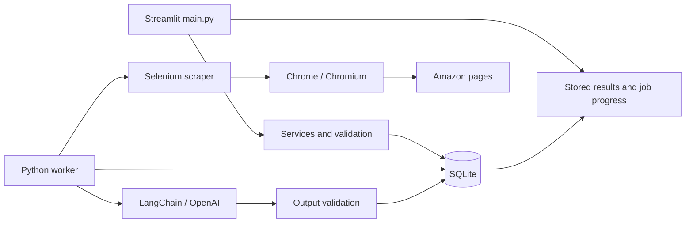

# Selenium + SQLite implementation plan

Prepared: 2026-09-30. Status: plan only; application implementation has not started.

## 1. Objective and scope

Replace every Oxylabs scraping path with Selenium WebDriver and replace TinyDB with SQLite. Preserve Python, Streamlit, LangChain, the OpenAI integration, python-dotenv, and uv. Preserve the user journey: enter an ASIN and marketplace/location, retrieve a product, discover competitors, refresh results, and request an LLM analysis.

The attached tools screenshot describes the original stack. It is reference material; the user's replacement request governs this work.

Interpret “production grade” as demonstrable reliability, data correctness, test coverage of failure paths, reproducible deployment, safe configuration, and operational documentation. Do not claim a particular hiring outcome or enterprise scale. The resulting repository should provide evidence of engineering judgment suitable for a portfolio and technical interviews.

### Fixed decisions

- Keep the existing Streamlit frontend and LangChain/OpenAI integration. Do not introduce React, FastAPI, a different LLM framework/provider, PostgreSQL, MongoDB, Redis, Celery, or Kubernetes.
- Use Selenium 4 with Chrome/Chromium for all live product and search acquisition. No Oxylabs API, requests/httpx product-page fallback, Playwright, stealth driver, proxy rotation, or CAPTCHA-solving service.
- Use Python's built-in `sqlite3`, parameterized SQL, and numbered SQL migrations. An ORM and Alembic are unnecessary for this scope.
- Keep Python 3.13 as the tested baseline. Preserve the existing package families; change versions only for a documented compatibility, support, or security reason. Check the actual bundled SQLite runtime separately from the Python version.
- Default deployment: one host, one Streamlit instance, one Python worker, one browser job at a time, and a persistent local SQLite volume. Multiple UI sessions may share this trusted workspace. Public multi-tenant SaaS and horizontal scaling are outside this release.
- Keep all seven existing marketplace choices: `com`, `ca`, `co.uk`, `de`, `fr`, `it`, `ae`. Implement adapters and fixtures for each. Record their real validation status; do not silently reduce support to `.com` or claim all locales have been live-tested.
- Add background execution using a small SQLite job table and Python worker. This is required for the finished release because competitor scraping can take minutes. No external queue service is needed.

### Suggested operational defaults

These are starting limits to validate and tune, not measured performance promises: one active browser, queue capacity 20, two search pages per query, at most three queries and six search-page navigations per competitor job, at most 20 competitor detail pages, a 15-minute overall scrape-job deadline, 30-second page-load timeout, 10-second element wait, and one retry for transient page failures. Start with a two-second minimum navigation interval. Retries count against the deadline and request budget. Make these named, validated configuration values.

Do not add schedules, alerts, CSV export, vector search, autonomous agents, or price-prediction features to the required migration. A price-history view can follow once snapshots and the core flow work.

## 2. Findings from this checkout

Inspected `main.py`, every current `src/*.py` module, `pyproject.toml`, `uv.lock`, `.python-version`, `.gitignore`, and the empty README. No `AGENTS.md`, tests, or `data.json` were found in the inspected project. This directory is not currently a Git repository. A `.env` file exists; its values were not read. Do not assume historical data or remote Git configuration exists.

| Location | Current behavior | Required correction |
| --- | --- | --- |
| `src/oxylabs_client.py` | Oxylabs HTTP calls and provider-specific normalized payloads | Replace with browser navigation, extraction, normalization, and typed outcomes |
| `src/oxylabs_client.py:97` | `content["products", list]` is a broken subscript in a fallback parser | Do not carry this provider parser into the new implementation |
| `src/oxylabs_client.py:119` | Four sort strategies multiplied by categories and pages | Use deterministic, bounded discovery; preserve evidence of where candidates came from |
| `src/oxylabs_client.py:174` | Broad exception handling silently drops failed products | Record per-item failures and distinguish partial results from success |
| `src/db.py` | ASIN-only lookup and append-only inserts | Marketplace/location identities, transactions, idempotency, history, and explicit relationships |
| `src/services.py:19-51` | Search uses the saved parent context; detail scraping uses current form arguments | Resolve one saved context and use it through the whole job |
| `src/services.py` | Search only happens when categories exist; sets destroy ordering | Add a title-based fallback and stable candidate ordering |
| `src/services.py` | One `parent_asin` field doubles as a relationship | Support the same competitor under multiple parents without overwriting data |
| `main.py:49-108` | ASIN-only selection and button keys; reruns can trigger network work | Select by context ID, use unique keys, enqueue only on explicit actions |
| `main.py:62-81` | Loads all rows, including competitors, before slicing | SQL pagination of explicitly tracked products |
| `main.py:70` | Duplicate `col2` assignment | Correct the layout variable error |
| `src/llm.py` | Hardcoded model, Python repr of competitors, weak missing-data handling, dollar fallback | Configured model, JSON input, grounded structured output, exact source currencies |
| `.gitignore` | Does not ignore `.env`, runtime databases, or artifacts | Add these before any repository publication |
| `README.md` | Empty | Setup, architecture, limitations, operations, and evidence of validation |

The lock currently contains Streamlit 1.49.1, LangChain 0.3.27, langchain-core 0.3.76, langchain-openai 0.3.33, OpenAI 1.107.2, Pydantic 2.11.9, and TinyDB 4.8.2. These are the observed baseline, not recommendations to freeze old versions indefinitely. Declare Pydantic directly because the application imports it. Do not blindly apply current LangChain 1.x examples to the existing 0.3 integration.

## 3. Architecture and file boundaries



Keep `main.py` as the entry point and retain `src/db.py`, `src/services.py`, and `src/llm.py` as recognizable modules. Add only modules with clear responsibilities:

```text
main.py                         Streamlit presentation and explicit user actions
src/config.py                   Validated environment settings and paths
src/models.py                   Pydantic contracts, enums, keys, result types
src/db.py                       Connection factory, migrations, repositories
src/services.py                 Use cases; no Streamlit imports
src/jobs.py                     Enqueue/claim/progress/lease/status operations
src/worker.py                   Bounded job execution and shutdown
src/llm.py                      Input assembly, LangChain call, output validation
src/logging_config.py           Structured logs and redaction
src/scraping/browser.py         Driver creation, waits, cleanup, timeouts
src/scraping/amazon.py          Product/search/location workflows
src/scraping/selectors.py       Named selector groups and locale variants
src/scraping/parsers.py         Pure parsing and normalization functions
src/scraping/errors.py          Scraping error codes and retry classification
migrations/001_initial.sql      Schema with constraints and indexes
scripts/migrate_tinydb.py       Offline JSON importer with dry-run/report
scripts/db_admin.py             Migrate, backup, restore verification, health
tests/unit/                     Pure logic and model tests
tests/integration/              SQLite, queue, and local-browser tests
tests/ui/                       Streamlit AppTest tests
tests/fixtures/amazon/          Sanitized/minimal representative HTML fixtures
docs/architecture.md            Decisions, invariants, deployment envelope
docs/operations.md              Runbook, backups, recovery, limitations
docs/validation.md              Version matrix and real execution evidence
.env.example                   Placeholders only
.github/workflows/ci.yml        Checks for an eventual GitHub repository
Dockerfile                     Reproducible non-root browser-capable image
compose.yaml                   UI and worker; same local persistent data volume
```

Delete `src/oxylabs_client.py` after its callers have been converted and replacement tests pass. Do not retain a hidden fallback. Historical migration documentation may mention Oxylabs and TinyDB; runtime code and dependencies must not use them.

## 4. Contracts and invariants: implement before integration

### Product and location identity

- Validate ASIN with `^[A-Z0-9]{10}$` after trimming and uppercasing. Domain must come from the seven-value allowlist. Construct URLs internally; do not accept arbitrary scrape URLs.
- A catalog product is `(asin, amazon_domain)`. A collection context is `(product_id, geo_key)`, where `geo_key` is a locale-normalized requested postal/delivery value, or an explicit default-location sentinel. Never strip meaningful leading zeros.
- Selection, caching, jobs, competitor relationships, and LLM inputs use a context ID, never an ASIN alone.
- Record requested location, observed/applied location, and `location_status` separately. A requested location that cannot be verified produces `location_unverified`; it must not be written as verified success. A blank input means the site's default context and must be labeled that way.
- Some marketplaces may require a city/address interaction rather than a postal code. Give each adapter an explicit capability and input label. Unsupported delivery inputs return a clear outcome; they must not be silently ignored.
- All timestamps generated by the new app are timezone-aware UTC.

### Typed data contracts

Define `ProductKey`, `CollectionContext`, `ProductSnapshot`, `SearchCandidate`, `ItemFailure`, `ScrapeOutcome`, `CompetitorRunResult`, `JobStatus`, and `AnalysisOutput`. Make optional fields truly optional with defaults.

`ProductSnapshot` includes: ASIN/domain/context IDs, requested and resolved ASIN, title, brand, canonical URL, price amount, ISO currency, price kind, availability, rating, rating count, images, categories/category path, product overview, selected variant/pack/condition information when available, location evidence/status, capture time, source, and extractor version. Missing values stay null. Keep legacy buybox/overview payloads in validated JSON fields when importing; do not pretend unsupported Selenium fields were extracted.

Money uses `Decimal` in Python and canonical decimal text in SQLite/JSON, never binary floats. Preserve the displayed price text as provenance. Parse separators by marketplace, including non-breaking spaces. Store missing/unavailable price as null, not zero. Avoid selecting crossed-out list price, installment price, coupon-adjusted price, or unit price as the current offer price. Do not infer USD merely from `$`.

Require a valid resolved product identity and non-empty title for a product success; price may be absent for unavailable products. If navigation resolves to a different variant ASIN, report a variant mismatch with the observed ASIN instead of silently saving its price against the requested ASIN. Make later acceptance of another variant an explicit action.

Suggested boundary signatures (names may be adjusted consistently):

```python
scrape_product(context: CollectionContext) -> ScrapeOutcome
discover_competitors(context_id: int, options: SearchOptions) -> CompetitorRunResult
enqueue_job(kind: JobKind, context_id: int, request_key: str) -> Job
get_job(job_id: str) -> Job
list_tracked_products(limit: int, offset: int) -> ProductPage
build_analysis_input(context_id: int, competitor_run_id: str) -> AnalysisInput
analyze_competitors(input: AnalysisInput) -> AnalysisOutput
```

Inject the repository, scraper, clock, and LLM client into services so failure paths are testable without Amazon or paid API calls. No `st.*` calls in the scraper, repository, worker, or LLM module.

## 5. SQLite schema and consistency

Use a normalized relational core with JSON only for lists and supplementary extracted data. Implement these tables in the first migration:

| Table | Essential columns / constraints |
| --- | --- |
| `schema_migrations` | Version primary key, checksum, applied timestamp |
| `products` | ID; ASIN; domain; unique `(asin, domain)` |
| `product_contexts` | ID; product FK; geo key; requested location; `is_tracked`; latest snapshot FK; active complete competitor-run FK; unique `(product_id, geo_key)` |
| `product_snapshots` | ID; context FK; unique capture key; capture time; normalized fields and evidence from section 4 |
| `jobs` | UUID; kind; context FK; request key; status; bounded options JSON; attempts; owner/lease token; heartbeat/expiry; progress; result reference; error code; created/started/finished times |
| `competitor_runs` | ID; parent context FK; frozen parent snapshot FK; job FK; query strategy/version; status; counts; timestamps |
| `competitor_run_items` | Run FK; competitor context FK; exact snapshot FK; rank; query/source/sponsored metadata; unique `(run_id, competitor_context_id)` |
| `analyses` | ID; parent snapshot and competitor-run FKs; input hash; model/prompt/schema versions; output JSON; status; usage if available; timestamps/error |
| `legacy_imports` | Source-file hash and source record ID unique together; target snapshot ID; import status/report details |

Store per-item errors and discovery counts in a bounded job-result JSON or a separate job-item table if querying them requires it. Document that decision before adding a new table. Add indexes for tracked-product pagination, snapshots by context/time, runs by parent/time, jobs by status/creation, and analysis input hashes. Use foreign keys and CHECK constraints for statuses, booleans, valid rank/rating ranges, and nonnegative amounts where applicable. Validate decimal text before insertion and hydrate it as `Decimal`; do not sort monetary text lexicographically.

Connection policy: configure WAL at initialization, enable foreign keys on every connection, use a bounded busy timeout, choose and document explicit transaction behavior, and close connections promptly. Start with `synchronous=FULL`. Never cache a raw connection in Streamlit or share one across threads. Keep network work outside transactions. SQLite WAL allows concurrent readers but one writer and requires a local shared filesystem, which is why this plan uses one host. [SQLite WAL documentation](https://www.sqlite.org/wal.html)

At startup record `sqlite3.sqlite_version`. Require a vetted runtime containing the WAL-reset fix before production WAL use. SQLite documents the fix in 3.51.3; check release notes for later fixes or documented backports rather than assuming the Python minor version is sufficient. Update the Python patch distribution/container runtime as needed while keeping Python and SQLite as the stack. [SQLite release news](https://sqlite.org/news.html)

### Transaction semantics

1. Upsert product/context identity, insert a snapshot, and update its latest pointer atomically. Retrying the same capture key must not create another snapshot; an intentional later refresh should.
2. Mark a context tracked only when the user adds it. Competitor discovery alone must not place every competitor on the tracked-products page.
3. Save competitor results under a new run with exact snapshot references. The same competitor may appear in multiple parents' runs.
4. Publish `active_complete_run_id` in one transaction only when discovery/detail processing completes without unhandled failures. A fully completed empty search is a valid empty run. A blocked/failed/partial run is not an empty success.
5. Preserve the previous complete run on partial or failed refresh, show its age, and expose the partial run separately. An explicit UI action may analyze a selected partial run with a warning. Never merge old and new rows into a supposedly current complete run.
6. Use the resolved parent domain/location throughout discovery and detail scraping. At the start of a competitor job, refresh the parent in that browser session if its snapshot is stale, imported/unverified, or its default delivery context cannot be matched. Freeze that parent snapshot for the run. Freeze parent and competitor snapshot IDs before an LLM call so concurrent refreshes cannot change its evidence.
7. A single source of idempotency controls duplicate enqueue requests. Reject or reuse an existing queued/running job for the same context and operation; allow a fresh explicit request after completion. Put the invariant in a DB constraint/transaction as well as UI state.
8. Only the current lease owner may publish a job result. Check the lease token in the same transaction that updates snapshots/run pointers/status so an expired worker cannot overwrite newer data.

Back up using `sqlite3.Connection.backup()` and verify restores with integrity/foreign-key checks and representative queries. Do not copy only the main database file while WAL writes are active. Use Python's documented parameter binding and backup facilities. [Python sqlite3 documentation](https://docs.python.org/3.13/library/sqlite3.html)

## 6. Selenium implementation requirements

### Browser lifecycle

- Implement a context-managed browser factory with headless configuration, fixed viewport, locale options, explicit page/script timeouts, and cleanup in `finally` even after startup/navigation/extraction failure.
- Use built-in Selenium Manager for local development when no driver path is configured. In deployment, install and verify a matching browser/driver pair during image build; startup must not depend on an unplanned download. [Selenium Manager](https://www.selenium.dev/documentation/selenium_manager/)
- Use a fresh temporary browser profile for each job and reuse that session within the job. Never share one driver between UI users, threads, or jobs. Remove the profile after cleanup.
- Use explicit waits for a recognized product/search/empty/error/block state. Keep implicit wait zero; do not mix implicit and explicit waits. Fixed sleeps may enforce request pacing but must not substitute for page readiness. [Selenium waiting strategies](https://www.selenium.dev/documentation/en/webdriver/waits/)
- Start Chrome as a non-root user with its sandbox enabled. Give its container adequate shared memory; do not adopt `--no-sandbox` as a default workaround.
- Limit navigation to constructed marketplace URLs and expected marketplace links. Validate redirects and canonical URLs. Browser JavaScript may read DOM state or page-provided data, but must not become a hidden HTTP scraping client.

### Product and location extraction

1. Load the marketplace, handle supported consent dialogs, apply the requested delivery context through the UI, and verify the displayed location. Recheck after redirects or marketplace changes.
2. Navigate to the ASIN page. Detect a product, unavailable product, not-found page, location failure, login wall, CAPTCHA, or other block before extracting.
3. Keep named selectors and ordered fallback groups in `selectors.py`. During implementation, inspect real rendered DOM where access is available and validate against fixtures. Do not invent a single universal selector or assume all pages share English text.
4. Extract visible DOM fields and supported page-provided structured data with recorded precedence. Do not execute strings copied from a page. Use pure parsing functions for normalization.
5. Preserve raw price text and extraction provenance. Check rating and review count separately. Deduplicate image URLs. Validate returned URLs and reasonable field lengths before storage or display.
6. Record optional-field warnings without declaring the entire scrape a failure. A missing title or identity is a parse failure, not an empty product.
7. For a default-location session, save the observed context and reuse it consistently across that job. Do not make verified postal-price claims. Skip location-sensitive numeric comparisons if parent/competitor context cannot be shown consistent.

### Discovery and relevance

Use a deterministic cleaned-title query first, then up to two distinct title/category refinements if useful. Do not erase defining model/size tokens through indiscriminate splitting at hyphens. Categories can refine query text; do not translate an arbitrary category name into an invented Amazon browse-node ID. Preserve the original candidate order while deduplicating ASINs and excluding the parent.

Read cards scoped to actual result containers; distinguish organic and sponsored results, exclude unrelated carousels, and label sponsored evidence. Default to organic candidates. Stop at a disabled/missing next-page control, a repeated result page, an explicit empty state, the page budget, or enough candidates. Detail-scrape the shortlisted products; search snippets alone are not full product observations.

Store candidate query/rank and a simple explainable relevance score based on available category, title/model, and variant attributes. Missing matching evidence is “uncertain,” not a manufactured match. Flag incompatible pack sizes, product types, currencies, or conditions. Present these as candidate competitors until comparability is established.

### Failure policy

Use stable error codes: `invalid_input`, `not_found`, `unavailable`, `location_unverified`, `variant_mismatch`, `blocked`, `timeout`, `parse_error`, `browser_error`, `deadline_exceeded`, and `cancelled`. `unavailable` may accompany a valid snapshot with null price. Retry only classified transient timeouts/stale-element/navigation failures, once, with bounded backoff. Do not retry invalid inputs or repeatedly hit block/login/CAPTCHA pages. Stop the job on a block and preserve previously collected partial evidence.

Save optional failure HTML/screenshots only under a configured private artifact directory, with a size limit and retention period. Disable raw capture by default. Redact location/cookie/credential information from logs. Fixture HTML must be sanitized and small. Selenium cannot guarantee access or selector stability; blocked pages are an expected operational outcome, not a reason to fake success or add evasion infrastructure.

## 7. Jobs, Streamlit, and LLM integration

### Durable worker

Implement `python -m src.worker` to poll and claim one job atomically using a short transaction. UI callbacks enqueue work and immediately display its durable ID. Worker functions never use Streamlit APIs.

States: `queued -> running -> succeeded | partial | failed | cancelled`; stale running jobs may be requeued once after lease expiry, with attempt counts and idempotent writes. Add cancellation requests, a worker heartbeat, an overall job deadline, and bounded queue size. Show worker-offline and queue-full states explicitly.

Use a supervised per-job child process when needed to enforce the overall deadline even if WebDriver hangs. Track only that job's browser/driver/process group; use appropriate Windows and Linux cleanup. Never kill every Chrome process on the host. Test normal shutdown, cancellation, expired leases, forced worker termination, and result fencing. Recovery may repeat external work; do not claim exactly-once network or paid LLM execution.

Prefer a supported Streamlit fragment/timed refresh to poll stored progress. If the pinned version requires another mechanism, document and test it. Do not use a blocking UI sleep loop or cached mutable drivers/connections. Streamlit documents limitations around app-code multithreading; a separate worker keeps that boundary simple. [Streamlit threading guidance](https://docs.streamlit.io/develop/concepts/design/multithreading)

### Streamlit behavior

- Wrap input in a form; validate before enqueue. Keep the input controls and existing product/competitor/analysis journey recognizable.
- Store `selected_context_id`, selected run ID, and job ID in session state. Build widget keys from context/run IDs.
- Show product cards only for tracked contexts, with SQL count/pagination and stable ordering. Clamp the selected page when result counts change.
- Display marketplace, requested/applied location, collection time, currency, availability, stale/partial status, and failures in plain language. A success banner requires a successful job result.
- Show actual competitor rows and source links before asking the LLM. Refresh is explicit; ordinary reruns must not enqueue work, re-scrape, or incur another LLM charge.
- Persist and reload completed analysis after reruns and restarts. Distinguish data age from analysis generation time.
- Keep external text as text/normal Markdown; do not enable unsafe HTML. Render missing price as “Unavailable” and missing currency as unknown, never an assumed dollar amount.

### LangChain/OpenAI behavior

Keep the existing analysis purpose and provider. Configure the model through `OPENAI_MODEL`; use an available model compatible with the selected integration, without requiring any particular coding model or silently changing provider. Validate the API key only when analysis is requested so scraping works without an LLM key.

Serialize a bounded, allowlisted input to JSON. Include product and competitor snapshot IDs, timestamps, exact decimal prices, ISO currencies, location/variant/comparability flags, and deterministic numeric comparisons. Compute min/median/percentage differences in Python for comparable offers only. Exclude unknown/mismatched currencies and zero/missing denominators; do not perform implicit FX conversion or present an observed offer as a complete shipping/tax-inclusive cost.

Treat all scraped text as untrusted data. The prompt must prohibit following instructions embedded in titles/descriptions and must require grounding claims in supplied evidence. The model has no browser, SQL, shell, or other tool access. Bound text length, candidate count, output tokens, timeout, and retry count.

Prefer schema-bound output if supported by the retained LangChain/OpenAI versions and configured model; otherwise retain the existing Pydantic parser with one bounded correction attempt. Verify APIs against the actual locked version. [LangChain structured-output method reference](https://reference.langchain.com/python/langchain-openai/chat_models/base/BaseChatOpenAI/with_structured_output)

Validate every returned competitor ID against the selected input. Render factual titles, prices, ratings, currencies, and links from stored snapshots rather than trusting model-echoed facts. Reject malformed or unsupported claims where mechanically checkable. Keep recommendations labeled as generated interpretation. Persist input hash, exact source references, model/prompt/schema versions, validated output, and usage when available. Reuse an analysis only when these inputs match; errors must not be cached as successful analysis.

## 8. Legacy data migration

Provide a standalone, offline importer even though no `data.json` is present in this checkout. Read TinyDB JSON using the standard library; the finished project does not need TinyDB installed.

1. Support the existing `products` table format, with source record IDs; detect unsupported layouts instead of assuming every JSON file is compatible.
2. Default to dry-run: validate rows, identities, lists, currency/price conversion, timestamps, duplicates, and parent relationships; produce counts and a machine-readable report.
3. Never edit/delete the source file. Before applying into an existing SQLite database, create a verified backup. Stop application writes for the import procedure.
4. Derive product/context identities from each record's domain and geo. Quarantine invalid/missing identity fields. Do not invent a domain or parent relationship. Preserve absent geo and unresolved timezone evidence as legacy-unknown values.
5. Import repeated historical rows as snapshots. Choose latest pointers using trustworthy timestamps, with a documented source-record-order fallback when timestamps are ambiguous. Preserve raw original timestamps; do not append `Z` to naive legacy values and call them UTC.
6. Recover `parent_asin` relationships only when parent marketplace/location match uniquely. Report missing/ambiguous parents and leave their imported snapshots intact. Legacy runs are marked imported/unverified and cannot masquerade as a newly completed verified scrape.
7. Preserve the original row in bounded legacy JSON for audit where fields cannot be mapped. Turn legacy floats into decimal strings with an explicit precision warning; lost precision cannot be recovered.
8. Use `(source_file_hash, source_record_id)` import bookkeeping for idempotency. A second import of the unchanged source inserts zero additional records. Altered sources require a new dry-run and an explicit merge decision.
9. Apply accepted rows and bookkeeping transactionally. Generate a final reconciliation report: read, imported, already present, duplicate observations, quarantined, and unresolved relationships. Roll back the transaction on operational failure.

## 9. Ordered implementation phases

Do one phase at a time, in dependency order. Each phase should be reviewable, leave tests passing, and record evidence in `docs/validation.md`. Intermediate releases need not be deployed. Never remove the current implementation before the replacing path is covered.

### Phase 0 — Baseline and configuration

Files: `pyproject.toml`, `uv.lock`, `.gitignore`, `.env.example`, `src/config.py`, initial README.

- Record current versions/import behavior without scraping or paid calls. Preserve `.env` contents; do not print them. Ignore `.env*` except the example, SQLite files/WAL/SHM, data, artifacts, logs, profiles, and local tool state.
- Add Selenium and direct Pydantic dependency. Add a dev dependency group with pytest, pytest-cov, Ruff, mypy, and dependency auditing. Keep runtime dependencies focused.
- Introduce validated settings for DB path, browser/headless/binary/driver, locale, timeouts, request/page/item/job limits, freshness threshold, artifact retention, and LLM model/key/timeouts. Bound untrusted per-job overrides by administrator settings.
- Regenerate and check `uv.lock`; do not hand-edit it. Audit dependencies and upgrade only as justified, retaining the named stack. Do not manually remove transitive requests if another retained package needs it.
- If no Git repository exists, document that fact; local execution of tests is still possible. Do not publish or create a remote merely to make CI appear complete.

Gate: a clean environment syncs from the lock; importing config has no network/browser side effects; invalid settings produce actionable errors; no secret values enter docs/logs.

### Phase 1 — Models and SQLite

Files: `src/models.py`, `src/db.py`, `migrations/001_initial.sql`, DB/model tests.

- Implement sections 4–5 as a new `SQLiteRepository`, including migrations and repository methods for jobs/runs/snapshots even if callers are added later. Temporarily retain the existing `Database` implementation for existing callers until the coordinated Phase 4 cutover; do not silently change its methods to incompatible signatures.
- Implement transaction rollback, snapshot idempotency, pagination, frozen evidence reads, active-run publication, and connection cleanup.
- Fail clearly on an unsupported/newer schema or altered applied migration checksum. Do not auto-downgrade an existing database.

Gate: same ASIN across domains/locations stays separate; repeated captures are idempotent; intentional refresh adds history; shared competitors work; foreign keys and rollback tests pass; readers and bounded concurrent writes work against a real temporary file.

### Phase 2 — Offline migration and database operations

Files: `scripts/migrate_tinydb.py`, `scripts/db_admin.py`, migration fixtures/tests.

- Implement section 8 and backup/restore verification before switching application data access.
- Test representative TinyDB exports, missing fields, naive timestamps, duplicate rows, malformed JSON, ambiguous parents, changed source files, and repeat imports.

Gate: dry-run writes nothing; applying leaves source bytes unchanged; a repeated identical import adds nothing; migration failure rolls back; restored DB passes integrity and representative query checks.

### Phase 3 — Browser foundation and product scraping

Files: `src/scraping/*`, product fixtures, browser integration tests.

- Implement browser lifecycle/error classification first, then `.com` product/location extraction, then the other six locale adapters.
- Test against deterministic local HTML served on localhost through real Selenium, plus pure parser tests. Production URL restrictions remain enabled; fixture access uses an explicit test-only configuration.
- Cover optional price, missing required title, blocked page, consent, geo verification, variant redirect, selector fallback, delayed rendering, localized money, and browser cleanup.

Gate: all seven locale fixture sets pass; no product HTTP client fallback exists; driver quits on tested failures; a controlled manual live check is separately recorded if environment/access permit. Missing live access is not a reason to fabricate a pass.

### Phase 4 — Competitor discovery and services

Files: `src/services.py`, discovery/parser code, integration tests.

- Implement deterministic query building, result pagination, budgets, deduplication, relevance flags, per-item errors, and transactional run publication.
- Convert services to typed repositories/scraper dependencies and remove Streamlit imports.
- Perform a coordinated caller cutover: update the minimal context-ID and repository plumbing in `main.py` and `src/llm.py` alongside services so no old `Database`, ASIN-only lookup, or `search_products` caller remains. The responsive UI and LLM hardening still belong to Phases 5–6; keep the synchronous flow functional at this intermediate gate.
- Replace all old scraper imports; delete `src/oxylabs_client.py`, the temporary legacy `Database` implementation, and TinyDB from dependencies once callers and importer no longer require them. Regenerate the lock.

Gate: missing categories still search; parent context is used end-to-end; duplicate/sponsored/repeated-page fixtures behave correctly; same competitor works for multiple parents; failed/partial refresh preserves prior complete results; a valid empty run is distinct from a failure.

### Phase 5 — Durable jobs and responsive UI

Files: `src/jobs.py`, `src/worker.py`, `main.py`, job and UI tests.

- Implement durable job claiming, idempotency, lease fencing, deadlines, recovery, cancellation, and progress first.
- Change UI callbacks to enqueue jobs; then replace ASIN-only state/keys and list slicing with context IDs and repository pagination.
- Persist statuses and display failure/partial/stale/worker-offline conditions. Fix the duplicate column assignment and broad image exception handling.

Gate: two UI sessions cannot claim/execute the same queued job; repeated reruns do not enqueue; restart recovers state; expired worker cannot publish; cancellation/deadline cleans owned browser processes; failed operations never show success banners.

### Phase 6 — Grounded LLM analysis

Files: `src/llm.py`, analysis job handler/UI, unit and integration tests.

- Implement the LLM behavior in section 7 with exact snapshot references and structured, bounded input/output.
- Add deterministic price comparisons, explicit missing/currency/location handling, result persistence, and input-hash reuse.

Gate: fake-model tests cover valid/malformed output, unknown ASINs, fabricated prices, prompt-injection text, incompatible currencies/variants, null data, API timeout/rate limits, missing key, cache invalidation, and rerun persistence. Automated tests use no paid calls. Any live LLM smoke test is opt-in and labeled separately.

### Phase 7 — Operations, CI, deployment, and handoff

Files: Dockerfile, compose, CI, logging, README, architecture/operations/validation docs.

- Run UI and worker from the same locked source/image with a local persistent volume, non-root user, browser sandbox, resource limits, and explicit startup migration step. Bind the default deployment to localhost/private access; public use requires an authenticated TLS gateway and workload limits.
- Add JSON logs with job/context IDs, stage, duration, outcome, retry count, and counts; redact secrets and location details. Provide a diagnostic command for configuration, DB schema/runtime, browser/driver availability, worker heartbeat, and pending-job count.
- Add retention/cleanup for artifacts and operational records without removing snapshots referenced by retained analyses. Document disk-full and SQLite-busy recovery, worker restarts, selector breakage, browser updates, LLM errors, backup/restore, and failed deployment rollback.
- CI runs locked installation, formatting/lint, type checking, unit/DB/UI tests, local Selenium fixture tests, dependency audit, and image build/smoke checks. Browser fixtures run on Linux CI; include Windows core tests because this checkout is on Windows. CI never scrapes Amazon or calls a paid LLM by default.
- Audit findings must be fixed or explicitly documented with rationale and review date; never suppress failures just to obtain a green badge.
- Populate README with architecture, screenshots/demo from real or clearly labeled fixture data, reproducible commands, tradeoffs, and measured test results. Record image/browser/driver/SQLite/dependency versions and locale validation status.

Gate: fresh checkout/container can start from documented commands; data survives restart; a complete deterministic UI-to-worker-to-SQLite-to-fake-LLM flow passes; backup restore works; dependency-audit status is disclosed; all remaining live-validation limitations are written down.

## 10. Acceptance test matrix

| Area | Required evidence |
| --- | --- |
| Stack | Python/Streamlit/LangChain/OpenAI remain; Selenium acquires every live product/search page; SQLite is the only runtime persistent database |
| Input | Invalid ASIN/domain/oversized location rejected before navigation; canonical URLs constructed safely |
| Identity | Same ASIN in two domains and two locations creates distinct contexts with correct selections/widget keys |
| Prices | `1,299.99`, `1.299,99`, `1 299,99`, CAD/USD ambiguity, null price, and non-English/locale-specific text tested |
| Extraction | Real Selenium on fixture pages tests delayed DOM, unavailable/not-found/blocked states, missing optional fields, variant mismatch, and selector fallback |
| Geography | Applied requested location verified; failure cannot be labeled success; parent and competitor collection context agree |
| Discovery | Stable order, deduplication, parent exclusion, organic/sponsored distinction, empty results, repeated pages, page cap, and missing category fallback |
| Persistence | Short transactions, rollback, SQL parameter binding, FK integrity, capture idempotency, migrations, pagination, and snapshot history |
| Refresh | Complete run published atomically; partial/failed run preserves prior complete set; all-failed run is not “0 competitors found” success |
| Worker | Duplicate enqueue/claim, restart, expired lease, fencing, cancellation, queue full, offline worker, and browser-process cleanup |
| UI | AppTest covers input validation, context selection, progress, failure/partial states, pagination, result persistence, and no rerun side effects |
| LLM | Schema validation, source grounding, hostile text, missing values, mixed currency, comparability, timeout, and cache invalidation |
| Migration | Dry-run, duplicates, relationship ambiguity, quarantined rows, unchanged source, repeated import, and transactional failure |
| Deployment | Locked install, container restart persistence, browser startup, secret redaction, runtime-version diagnostics, backup/restore drill |

Use Streamlit's AppTest for UI behavior with injected/fake services; complement it with the separate real-browser scraper tests. [Streamlit app testing](https://docs.streamlit.io/develop/concepts/app-testing)

Suggested quality gate: at least 80% branch coverage for the new core models/repository/parsing/services/jobs/LLM logic, plus explicit tests for every critical failure above. Coverage is not evidence of live Amazon access. Record test counts and commands actually run rather than invented metrics.

### Commands the implementation should make work

These are future acceptance commands, not commands already executed for this plan. Use the exact CLI option names below when adding the scripts, or update this section and README together.

```powershell
uv sync --locked --group dev
uv run ruff check .
uv run ruff format --check .
uv run mypy src main.py
uv run pytest -m "not live" --cov=src --cov-branch
uv run pip-audit
uv run python -m scripts.db_admin migrate
uv run python -m scripts.db_admin health
uv run python -m scripts.migrate_tinydb --source data.json --dry-run
uv run python -m scripts.migrate_tinydb --source data.json --apply
uv run python -m src.worker
```

Run the UI in a second terminal: `uv run streamlit run main.py`. The importer commands apply only if a legacy source file exists. Define `live` as a registered pytest marker with an additional explicit environment opt-in so ordinary test runs cannot unexpectedly contact Amazon or a paid API. Add `scripts/__init__.py` if needed for module execution.

Deployment commands: `docker compose build`, then `docker compose up -d`; the composition must run migrations once before app/worker readiness. Document clean shutdown and restoration without deleting the user's volume.

## 11. Release and rollback

Before first release, back up any real legacy data, run an import dry-run, review its reconciliation report, and verify the migrated DB independently. Keep the old JSON intact. Promote only a version whose deterministic checks pass; record live checks and any unresolved marketplace access limitations separately.

For application rollback, stop the worker and UI, back up the current DB, then restore the compatible pre-release DB and application build if the schema is not backward compatible. Do not attempt an untested SQL downgrade, silently resume an Oxylabs fallback, or copy an old SQLite binary over a live WAL database. After restore, mark abandoned jobs recoverable/cancelled under the documented recovery policy before starting the worker.

Completion requires both replacements, working preserved user flows, the critical bug fixes, tested failure behavior, and deployment/operations documentation. The existence of new Selenium and SQLite files alone is not completion. A marketplace with blocked live validation must be reported as such; fixture support and verified live support are separate claims.

## 12. Copy-ready instruction for the implementing model

```text
Implement IMPLEMENTATION_PLAN.md in this repository, starting with Phase 0 and
continuing in order. Preserve Python 3.13, Streamlit, LangChain, OpenAI, dotenv,
and uv. Replace all Oxylabs scraping with Selenium and all TinyDB runtime
storage with SQLite. Follow the contracts, context identities, snapshot/run
semantics, job lifecycle, and acceptance gates in the plan.

Before each phase, inspect the relevant current files and report any material
conflict between code and plan. Implement one bounded phase at a time; do not
rewrite the whole app in one pass. Add tests that verify behavior and failure
paths, run that phase's checks, and fix failures before moving on. Do not mark
untested work complete or invent live validation results.

Do not read out secrets, overwrite .env, delete original data, add an Oxylabs
fallback, bypass blocked pages, or replace preserved stack components. Make
routine implementation decisions within the documented single-host scope.
If an external prerequisite is unavailable, finish all independent work and
record exactly which validation remains blocked and why.

Keep docs/validation.md current with phase status, changed files, commands
actually run and their outcomes, relevant versions, decisions, and the next
unfinished step so another model can resume. Only report the entire project
complete after every mandatory release gate is satisfied or explicitly report
the remaining blockers. Deliver a concise summary of behavior changes,
validation evidence, setup commands, and known limits.
```

The plan is intentionally explicit enough for a model such as GPT-5.6 Terra at high reasoning effort to execute in sequential tasks. No special model-specific capability is assumed, and no app model setting needs to change to use this handoff.
