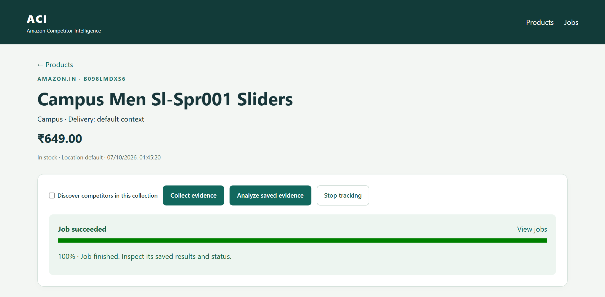
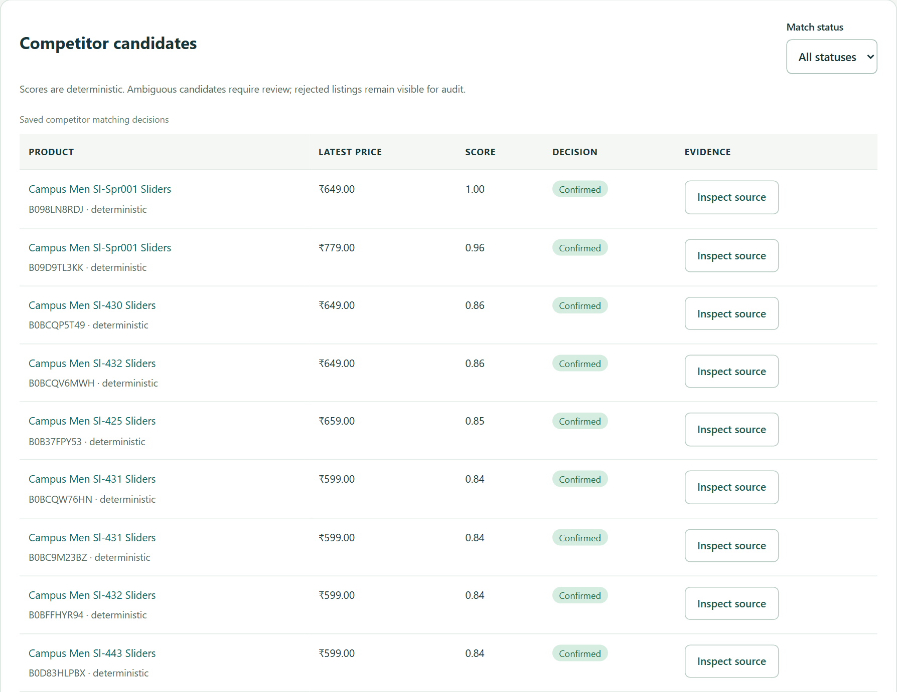
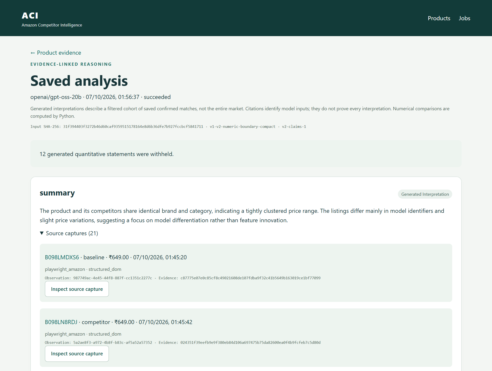
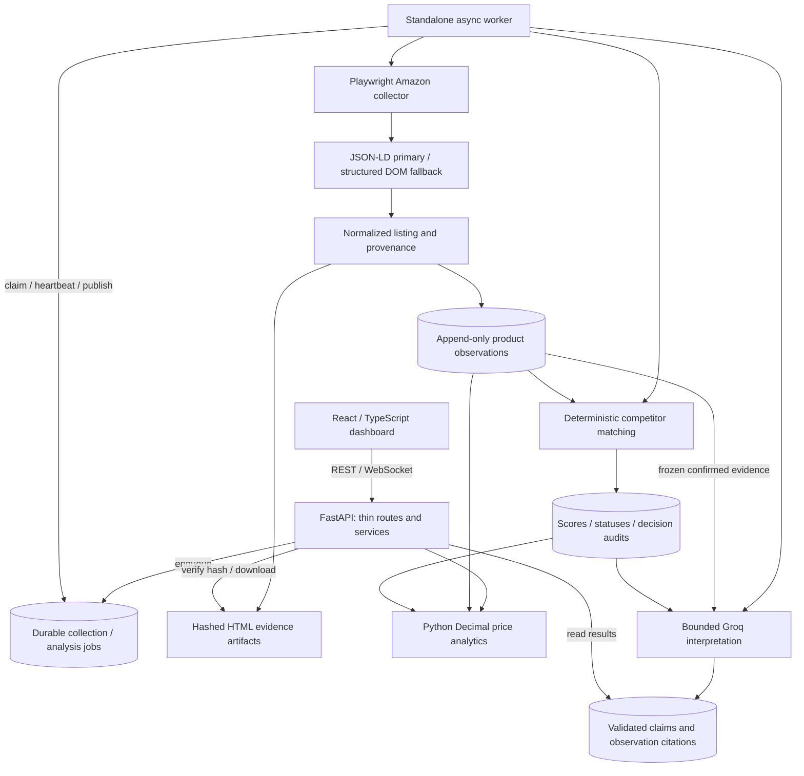

# Amazon Competitor Intelligence

An evidence-backed e-commerce research platform that collects real Amazon listings with Playwright, preserves historical observations, matches comparable products deterministically, computes competitive pricing analytics, and generates bounded AI insights grounded in stored evidence. I developed V2 as a React/TypeScript and FastAPI application with PostgreSQL-compatible persistence and a durable collection worker.



**Verified local demo:** ₹649 captured price · 20 confirmed competitors · 47 evidence-linked analysis claims. These are results from one saved Amazon India collection, not accuracy or market-coverage metrics.

## Demo / Screenshots

**Competitor intelligence:** saved listing prices, deterministic scores, match decisions and source inspection. This view shows a subset of the 20 confirmed candidates.



**Evidence-backed analysis:** a real Groq interpretation alongside its exact source observations. Generated numerical prose is withheld; authoritative comparisons are computed by Python.



More views: [dashboard](docs/assets/screenshots/dashboard.png) · [competitive analytics](docs/assets/screenshots/price-analytics.png) · [evidence inspector](docs/assets/screenshots/evidence-provenance.png).

All six screenshots come directly from the running application and genuine saved data. The baseline was captured on **7 October 2026 at 01:45 IST**. Its single historical point is shown honestly; multi-day history is not seeded. See the [screenshot record](docs/assets/screenshots/README.md) for capture details.

## What Problem It Solves

A price tracker can show that a price changed. Competitive research also needs to establish which listings are comparable, account for delivery context, and retain the sources behind its conclusions. Manual spreadsheets and standalone AI summaries often lose that context.

This project connects those steps to answer:

- What was the product selling for when it was captured?
- Which saved listings qualify as comparable competitors, and why?
- Where does its price sit within that confirmed comparison cohort?
- Which source page, observation and capture metadata support each factual value?
- What competitive interpretation can be drawn from the collected evidence?

## V1 → V2 Evolution

V1 established the research workflow. V2 carries its evidence and validation principles into an application with separate API, browser worker and frontend boundaries.

| Area | V1 prototype | Engineered V2 |
| --- | --- | --- |
| Interface | Streamlit | React, TypeScript and Vite |
| Collection | Selenium | Async Playwright with managed browser contexts |
| API | Application service calls | FastAPI REST API and job WebSockets |
| Persistence | SQLite | Async SQLAlchemy, PostgreSQL and local SQLite |
| History and sources | Saved snapshots | Append-only observations and per-capture provenance |
| Comparison | Simpler competitor filtering and analysis | Audited deterministic scoring and structured analytics |
| AI | Groq-assisted summaries | Bounded interpretations with persisted claim-to-observation links |
| Work lifecycle | Prototype collection jobs | Durable jobs with leases, heartbeats and ownership checks |

V1 remains available in `main.py` and `src/`, with `compose.v1.yaml`. Its database and volumes are separate; V2 does not overwrite or automatically import V1 history.

## Architecture



Database records live in PostgreSQL for Docker or SQLite for native development. Evidence files are kept alongside them in persistent storage. Browser and provider calls run in the worker without holding a database transaction. API handlers delegate to services and repositories.

## Core Engineering Decisions

### Real browser collection

Playwright navigates actual Amazon product and search pages. Browser contexts isolate marketplace state; pages and resources close through managed lifecycle boundaries. CAPTCHA and access restrictions produce explicit job failures and a marketplace cooldown.

### Structured extraction first

JSON-LD supplies product data where available. Structured DOM selector chains provide fallbacks. Extracted prices, currencies, ratings and counts are normalized before publication; absent values are not invented.

### Append-only observations

Successful refreshes append dated `ProductObservation` records. They preserve historical values and frozen listing metadata. A uniqueness constraint prevents duplicate publication of the same capture, while untracking keeps existing history.

### Evidence provenance

Each observation requires its source URL, capture time, collector, extraction method and evidence hash. Per-capture artifacts retain their identity and metadata. Downloads verify file size and SHA-256 before serving HTML as an attachment.

### Deterministic competitor matching

Comparability is evaluated through explicit exclusions and weighted attributes. Decisions retain their inputs, policy, scores and reasons, making them inspectable without an opaque model deciding factual compatibility.

### LLM only where useful

Groq explains a frozen cohort of confirmed saved evidence. Python computes authoritative price and rating comparisons. Model-generated numeric prose and unknown competitor identities cannot become published factual claims.

## Competitor Matching

The implemented policy combines title token similarity (35%), brand agreement (25%), category overlap (20%), logarithmic price proximity (15%) and rating proximity (5%).

| Status | Decision rule |
| --- | --- |
| `confirmed` | Score ≥ 0.70 after compatibility checks |
| `ambiguous` | Score ≥ 0.30 and < 0.70; needs review |
| `rejected` | Score < 0.30 or an explicit incompatibility |

Hard exclusions cover marketplace/delivery mismatch, the same ASIN, sponsored or compatibility listings, missing or incompatible prices/currencies, and known conflicting structured attributes such as pack size, capacity, dimensions or variant. Missing specifications are not guessed. Scores indicate policy agreement, not statistical confidence, authenticity or product quality. No trained matching model or automatic LLM promotion is used.

## Competitive Analytics

Python `Decimal` calculations support:

- Captured minimum, maximum, average and daily capture averages.
- Previous/current price, absolute change and percentage change.
- Rising, falling, stable or insufficient-data trends, comparing recent and prior seven-day capture averages.
- Price rank, percentile and median within the saved confirmed cohort.
- Observation counts, comparability exclusions and CSV export with provenance.

Currencies and delivery contexts stay separate. Missing prices are omitted rather than set to zero; missing days are not interpolated. In the pictured demo, the tracked price ranks **16 of 21** listings, with a **₹599 cohort median**. A trend remains unavailable because the baseline has only one genuine capture.

## Evidence-Backed AI

LangChain's Groq integration requests structured qualitative output, validates it and persists each published claim with exact observation citations. Complete provenance stays in the frozen local input; the provider receives compact listing facts for the full selected cohort. Input hashes and model/prompt/schema versions support result reuse. Output is bounded, with safe messages for provider configuration, size and quota failures.

In the verified local demo, the saved analysis produced **47 claims linked to stored evidence: 7 generated interpretations and 40 deterministic comparisons**. This is a saved-run result, not an independently measured accuracy claim. Citations establish which observations were supplied; they do not prove every interpretation. The source inspector exposes capture metadata and verified downloads.

## Tech Stack

| Component | Technologies | Responsibility |
| --- | --- | --- |
| Frontend | React 18, TypeScript, Vite, Tailwind CSS/custom CSS | Research dashboard and responsive views |
| Client state and charts | TanStack Query, React Router, Recharts | API caching, navigation and capture/cohort charts |
| Backend | FastAPI, Pydantic v2, pydantic-settings | Typed contracts, thin routes, validation and configuration |
| Browser automation | Playwright, Chromium | Collection, structured extraction and access-block detection |
| Persistence | SQLAlchemy 2 async, PostgreSQL 16, SQLite, Alembic | Durable jobs, observations, matching audits, claims and migrations |
| Analytics | Python Decimal | Monetary statistics and authoritative comparisons |
| AI | LangChain, Groq, GPT-OSS in the verified demo | Bounded structured interpretation of saved evidence |
| Testing and quality | pytest, Vitest, Playwright, Ruff, mypy, ESLint, Prettier | Regression, integration, browser, type and formatting checks |
| Local runtime | Docker Compose, nginx | Database, migration task, API, worker and frontend |

## API / Major Capabilities

| Capability | Main endpoints |
| --- | --- |
| Track listings | `POST /api/products`, `GET /api/products/{id}`, `DELETE /api/products/{id}` to untrack |
| Collect and discover | `POST /api/products/{id}/collect`, `POST /api/products/{id}/competitors/scan` |
| Inspect history and decisions | `GET /api/products/{id}/observations`, `GET /api/products/{id}/competitors` |
| Monitor work | `GET /api/jobs`, `GET /api/jobs/{id}`, `/ws/jobs/{id}` |
| Inspect sources | `GET /api/evidence/{id}`, `GET /api/evidence/{id}/content` |
| Analyze saved evidence | `POST /api/products/{id}/analyze`, `GET /api/analyses/{id}` |
| Compute/export | Product `/analytics`, `/position`, `/observations/export` endpoints |

Interactive request/response contracts are available in Swagger at `/docs`. Collection and analysis enqueue jobs rather than hold an HTTP request open.

## Running Locally

Install Docker with Compose and use Linux containers. From the repository root:

```powershell
Copy-Item .env.example .env  # First setup only; preserve an existing .env.
```

For optional AI analysis, edit the **root `.env`** locally:

```dotenv
APP_GROQ_API_KEY=your_groq_api_key
APP_GROQ_MODEL=openai/gpt-oss-20b
```

Never put credentials in frontend variables or commit `.env`. Collection and analytics work without a Groq key. Start the stack:

```powershell
docker compose up --build
```

- Application: [http://localhost:5173](http://localhost:5173)
- API documentation: [http://localhost:8000/docs](http://localhost:8000/docs)
- Health: [http://localhost:8000/health](http://localhost:8000/health)

Compose waits for PostgreSQL, applies Alembic, then starts API, worker and frontend. Initial dependency/browser downloads can take several minutes. Named volumes preserve database and evidence. `docker compose down` stops services while retaining those volumes. After changing the key, use `docker compose up -d --force-recreate backend worker`.

Native Python/Node commands, configuration and troubleshooting are in the [local development guide](docs/V2_DEMO_GUIDE.md). This project is intended for local research; no public deployment workflow is configured.

## Demo Flow

Register an actual ASIN or Amazon URL with the correct marketplace → collect a baseline with competitor discovery → inspect match decisions and pricing position → request analysis → follow claim citations to captured evidence. Collect again over time to build real history.

The [step-by-step demo guide](docs/V2_DEMO_GUIDE.md#demo-walkthrough) explains each step, failure recovery and CSV export. A new checkout starts with its own database; the screenshots do not imply that demo records are preloaded.

## Verification

The verified application checkpoint `b63c700` passed **319 Python tests** and **17 frontend tests**, with Ruff/formatting, mypy, TypeScript, ESLint, Prettier, compile and production build checks. Backend coverage was **92.21%** under the approved Amazon-adapter exclusion. PostgreSQL 16, SQLite, migrations and real Chromium were exercised.

Real `amazon.in` collection and an actual Groq analysis were verified, including source attachment hashing and desktop/mobile browser checks. This documentation update rechecked the healthy running stack, saved demo results and screenshot rendering; it does not claim a new full-suite run or remote CI result.

See the [engineering report](docs/V2_FINAL_ENGINEERING_REPORT.md), [collection/analysis verification](docs/V2_COLLECTION_FAILURE_FIX.md) and [test commands](docs/V2_DEMO_GUIDE.md#verification-commands) for details.

## Known Limitations

- Amazon may present CAPTCHA, sign-in or access challenges; scraping success is not guaranteed.
- Amazon DOM structure can change, and delivery/location behavior varies by marketplace.
- True multi-day price history requires observations collected over time.
- AI interpretation requires configured Groq credentials and remains subject to account/model limits.
- Matching is conservative and does not certify authenticity, quality or semantic equivalence.
- Saved cohort prices may have different capture times; they do not represent the entire market.
- This is a local personal research project, not a commercial-scale scraper or authenticated public service. Single-worker operation is the supported model.

## License

[MIT](LICENSE)
