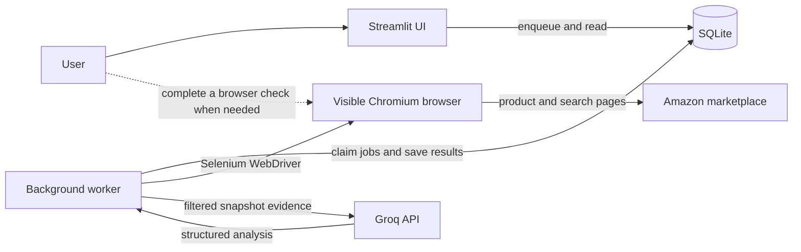

# Amazon Price & Competitor Analysis

An application for collecting Amazon product and competitor evidence, tracking it over time, and generating a grounded market analysis. I built it with Streamlit, Selenium, SQLite, and Groq to make competitor research more repeatable and easier to audit.

## The problem

Comparing a product with Amazon search results by hand means repeatedly opening listings, recording prices and availability, checking the delivery location, and deciding which results are actually comparable. The information can change between visits. A list of prices alone also loses the source, time, and conditions under which each price was observed.

## How the project solves it

1. Enter an Amazon ASIN, marketplace, and optional delivery location.
2. A background worker opens the product with Selenium and records a dated snapshot, including its source URL, price, currency, availability, and location verification status.
3. **Refresh competitors** searches the same marketplace, collects listing snapshots in one browser session, and publishes a run with its successes and failures. An incomplete refresh cannot replace an earlier complete run.
4. A conservative relevance filter selects listings that can reasonably be compared with the tracked product. The full set of saved search observations remains visible.
5. **Analyze with LLM** sends only the frozen, selected evidence to a Groq-hosted model. The saved report is linked to the exact product and competitor snapshots used to create it.

This workflow separates observed marketplace facts from generated interpretation. It does not treat a listing title or a model response as proof of product quality or authenticity.

## System architecture



The UI validates input and displays persisted results. It does not run long browser or LLM calls during a Streamlit rerun. The worker owns one browser session per scraping job and writes observations to SQLite. Product snapshots are immutable; competitor runs and analyses reference the saved snapshots they used. A failed or partial refresh preserves the previous complete run.

SQLite provides the job queue, product and location identities, snapshot history, competitor runs, and analysis records. It uses migrations, foreign keys, WAL, and short transactions. The browser profile persists between jobs so browser state is not discarded after every listing.

## Tech stack

| Component | Technology | Responsibility |
| --- | --- | --- |
| Interface | Python, Streamlit | Product input, job progress, saved evidence, and analysis display |
| Scraping | Selenium WebDriver, Chromium | Navigate Amazon product and search pages, extract listing data, verify location, and detect access challenges |
| Human browser view | Selenium standalone Chromium, noVNC | Let a user complete a genuine Amazon browser check while the worker waits |
| Storage and job queue | SQLite | Durable jobs, snapshots, competitor runs, analyses, migrations, and cooldowns |
| AI analysis | LangChain, Groq, Pydantic | Request structured analysis over saved evidence and validate the returned data |
| Local orchestration | Docker Compose | Run the UI, worker, migration task, and browser with persistent volumes |
| Quality checks | pytest, Ruff, mypy | Regression tests, lint and formatting, and static type checks |

Key implementation modules are [`main.py`](main.py) for the UI, [`src/worker.py`](src/worker.py) for job execution, [`src/scraping/amazon.py`](src/scraping/amazon.py) for Selenium workflows, [`src/db.py`](src/db.py) for persistence, [`src/relevance.py`](src/relevance.py) for comparison selection, and [`src/llm.py`](src/llm.py) for grounded analysis.

## Reliability and evidence rules

- A job remains identifiable across Streamlit reruns. The worker records progress and terminal status in SQLite.
- Each observation keeps its capture time, marketplace, source URL, price text, currency, and delivery-location status. Later refreshes add snapshots rather than rewriting old observations.
- Analysis compares prices only when currencies match, and requires a verified delivery location when one was requested. It filters out some compatibility listings and different-market versions; this is a relevance filter, not an authenticity judgment.
- Groq receives the selected snapshot evidence, not browser access or database credentials. Generated competitor ASINs must belong to the saved comparison set.
- Browser navigation is paced. When Amazon presents a challenge, the job offers a visible browser for manual completion, waits for a bounded time, and applies a marketplace cooldown if the challenge remains unresolved. No automatic CAPTCHA solver is used.

## Run locally with Docker

Install Docker Desktop (or Docker Engine with Compose), then from the repository root:

```powershell
Copy-Item .env.example .env
# Edit .env: set GROQ_API_KEY for AI analysis and choose an APP_BROWSER_VNC_PASSWORD.
docker compose up -d --build
docker compose exec -T app uv run --no-sync python -m scripts.db_admin health
```

Open the [Streamlit app](http://localhost:8501). If a running job asks for a human browser check, open the [browser view](http://localhost:7900), click **Connect**, and use the password set in `.env`. The job resumes when the check is complete. `GROQ_API_KEY` is required only for **Analyze with LLM**.

The `app-data` volume holds SQLite and the `browser-profiles` volume holds browser state. Keep both volumes when updating the stack. Back up SQLite with the [database admin command](docs/operations.md) before migrations. These services are designed for one machine and one worker.

## Run the checks

With Python 3.13 and `uv` installed:

```powershell
uv sync --locked --group dev
uv run pytest -q --basetemp .test-tmp
uv run ruff check .
uv run ruff format --check .
uv run mypy src main.py
```

Automated tests use simulated pages and model responses. Live Amazon access varies by marketplace, location, and time; the [validation record](docs/validation.md) distinguishes live checks from automated checks.

## Limitations

Amazon can still require a human CAPTCHA or deny access. Prices can be missing or location-dependent, and a saved snapshot is a point-in-time observation rather than a live price feed. Groq is a hosted API for open-weight models; its availability and free-tier limits depend on the provider. The application does not convert currencies or make claims about product authenticity.

For schema and operational details, see [architecture](docs/architecture.md), [operations](docs/operations.md), and [validation](docs/validation.md).
