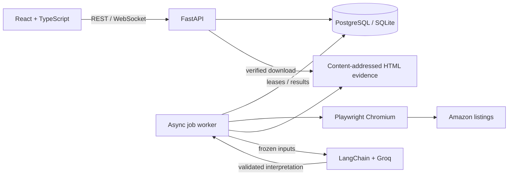

# Amazon Competitor Intelligence

I built this project to make Amazon product research repeatable and auditable. It
collects dated listing evidence, identifies comparable products, tracks captured
prices, and produces optional AI interpretations linked to their inputs.

## Problem and approach

Manual competitor research loses context: prices change, delivery locations affect
offers, and search results mix competing products with accessories and variants.
An AI summary alone cannot establish where its conclusions came from.

This application keeps the source URL, UTC capture time, extraction method and
SHA-256 evidence hash for each observation. Refreshes append observations rather
than replace history. Deterministic matching rejects known incompatibilities and
records its score and reasons. Python computes price statistics; Groq interprets
only a frozen set of saved evidence. The interface labels those responsibilities
and lets the reader inspect the underlying captures.

## Architecture and technology



| Component | Role |
| --- | --- |
| React, TypeScript, Vite, Tailwind CSS | Dashboard, product history, jobs and evidence-linked analysis |
| TanStack Query, React Router, Recharts | API state, navigation and charts of actual captures |
| FastAPI, Pydantic, pydantic-settings | Thin REST routes, typed contracts, validation and configuration |
| SQLAlchemy 2 async, PostgreSQL, SQLite | Products, append-only observations, matching audits, durable jobs and claims |
| Alembic | Versioned schema upgrades for both databases |
| Playwright, Chromium | Browser lifecycle, JSON-LD extraction, structured DOM fallback and access-block detection |
| Python Decimal | Matching inputs, price changes, capture averages, trends and cohort position |
| LangChain, Groq | Optional structured qualitative reasoning with exact observation citations |
| pytest, Vitest, Ruff, mypy, ESLint | Regression, integration, type and quality checks |

The API enqueues work; the standalone worker owns browser and model calls. Database
leases, heartbeats and ownership checks prevent stale workers from publishing.
Successful analysis runs reuse an identity based on frozen inputs and policy/model
versions. No Redis, Celery, agents or LangGraph infrastructure is required.

## Run locally

Install Docker with Compose. From the repository root:

```powershell
Copy-Item .env.example .env  # First setup only; preserve an existing .env.
docker compose up --build
```

Open **[the application](http://localhost:5173)** and
**[Swagger API documentation](http://localhost:8000/docs)**. Compose starts
PostgreSQL, the migration task, API, worker and frontend. Initial image/browser
downloads depend on connection speed. Named volumes preserve database, evidence
and per-marketplace browser state. `docker compose down` stops the stack while
keeping those volumes.

Collection and analytics work without an API key. For AI insight, set
`APP_GROQ_API_KEY` in the untracked `.env`, then recreate API and worker containers.
Groq is an external service with its own availability and account limits; the
application does not guarantee free or unlimited inference.

Register an ASIN or supported Amazon product URL, open the product, collect a
baseline, discover competitors, inspect the match table and captured evidence,
then request analysis. Repeated successful collections populate the history chart.
Missing prices stay missing; currencies are never silently converted.

See the **[demo and native development guide](docs/V2_DEMO_GUIDE.md)** for exact
commands, configuration, tests and recovery steps, and the
**[engineering report](docs/V2_FINAL_ENGINEERING_REPORT.md)** for verification and
limitations. The approved design and phase reports are in [docs](docs/).

## Operating boundaries

This is a local personal research application, with no public deployment workflow
or authentication. Compose binds published ports to localhost. Collection/analysis
requests have five-per-minute budgets, evidence defaults to a 5 MiB cap, and
analysis inputs to 128 KiB. Configure these through the documented `APP_*` settings.

Amazon can present a CAPTCHA, sign-in requirement or access block. The worker
records the failure, preserves saved evidence and applies a marketplace cooldown;
V2 does not automatically solve challenges. Marketplace selectors and location
verification remain sensitive to page changes. Matching is conservative, not a
test of authenticity or product quality. Citations identify the evidence supplied
to the model; they do not prove that an interpretation is correct.

Charts describe sampled capture history and a saved competitor cohort, not the
entire market. Seven days of history require seven real days of collection. No
historical prices or production browser results are fabricated.

The original Streamlit/Selenium/SQLite implementation remains available under
`main.py` and `src/`, with `Dockerfile.v1` and `compose.v1.yaml`. Its database and
volumes are separate; V2 does not automatically import or overwrite V1 data.
