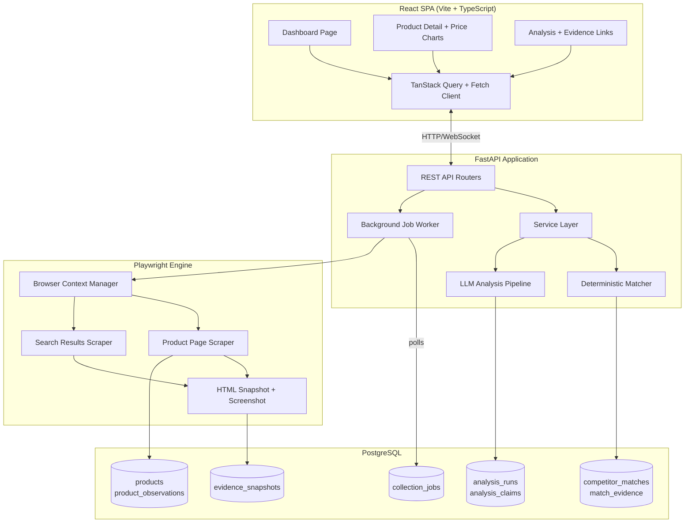
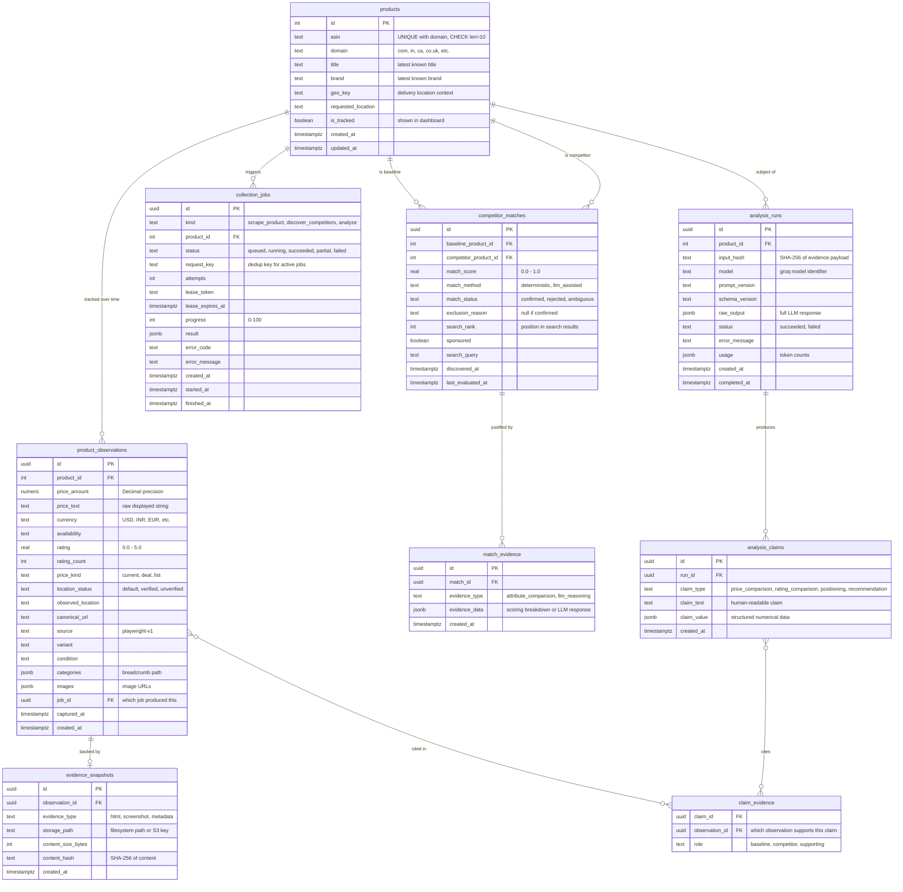

# Amazon Competitor Intelligence V2 — Architecture Document

## 1. Executive Summary

Amazon Competitor Intelligence V2 is a full-stack application that tracks Amazon product listings, discovers competitors, records price history over time, and produces evidence-grounded competitive analysis using LLM reasoning.

V2 replaces the V1 Streamlit+Selenium+SQLite prototype with a production-style architecture: a React/TypeScript dashboard backed by a FastAPI REST API, Playwright-based browser automation, and PostgreSQL for durable storage. The core value proposition — *every AI-generated claim is traceable to stored evidence* — carries forward from V1 and is strengthened with structured claim-to-evidence linking.

**Elevator pitch**: Track any Amazon product, automatically discover competitors, build price history, and get AI-generated competitive analysis where every number links back to the exact page observation that produced it.

---

## 2. Architecture Overview



### Layer Communication

| From → To | Mechanism |
|---|---|
| Frontend → Backend | HTTP REST (JSON) + WebSocket for job progress |
| Backend → Database | asyncpg connection pool (async SQL) |
| Backend → Worker | PostgreSQL job table polling with `FOR UPDATE SKIP LOCKED` |
| Worker → Playwright | Async Playwright API within the worker process |
| Worker → Database | Direct asyncpg writes for observations and evidence |

---

## 3. Technology Stack

| Component | Technology | Replaces (V1) | Justification |
|---|---|---|---|
| Frontend | React 18, Vite, TypeScript | Streamlit | Component reuse, interactive charts, responsive design, custom routing |
| Charts | Recharts | Streamlit st.metric | Interactive time-series line charts, tooltips, zoom |
| Styling | Tailwind CSS | Streamlit default | Rapid utility-first styling, dark mode, responsive |
| Data Fetching | TanStack Query v5 | st.session_state | Caching, background refetch, optimistic updates |
| Backend | FastAPI (Python ≥3.13) | Direct Streamlit calls | Typed REST API, auto OpenAPI docs, async, dependency injection |
| Database | PostgreSQL 16 | SQLite | Concurrent writes, window functions, JSONB, `SKIP LOCKED` queuing |
| DB Access | asyncpg | sqlite3 | Native async PostgreSQL driver, connection pooling |
| Migrations | Alembic | Custom SQL runner | Standard migration tool, auto-diff, rollback support |
| Browser | Playwright | Selenium + undetected-chromedriver | Async, auto-wait, native network interception, less flaky |
| LLM | LangChain + Groq (ChatGroq) | *Preserved* | V1's prompt engineering, structured output, anti-hallucination all carry forward |
| Models | Pydantic v2 | Frozen dataclasses | FastAPI integration, JSON Schema generation, serialization |
| Config | pydantic-settings | python-dotenv + dataclass | Type-safe env parsing with validation |
| Logging | structlog | Custom JSON formatter | Structured logging with context binding |
| Testing | pytest, Vitest, Playwright Test | pytest | Pyramid: unit → integration → e2e |
| Linting | ruff, mypy, ESLint, Prettier | ruff, mypy | Full-stack static analysis |

### What Is Preserved from V1

These V1 components carry forward with minimal changes because they are well-designed and framework-independent:

- **`parsers.py`** — All 6 pure parsing functions (`clean_text`, `parse_decimal_price`, `parse_rating`, `parse_count`, `product_asin_from_url`, `normalized_query`). Zero framework dependencies.
- **`selectors.py`** — CSS selector chains work identically in Playwright's `page.locator()`.
- **`relevance.py`** — `select_comparable_competitors()` and `_brand()` are pure functions with exclusion audit trail.
- **`errors.py`** — `ScrapeErrorCode` enum and `ScrapingError` class.
- **LLM prompt template** — Evidence-as-untrusted-data instruction, anti-hallucination ASIN validation, three-tier schema resilience (strict → recovery → fallback), `input_hash` deduplication.

---

## 4. Repository Structure

```text
amazon-competitor-v2/
├── backend/
│   ├── app/
│   │   ├── __init__.py
│   │   ├── main.py                 # FastAPI app factory, middleware, lifespan
│   │   ├── api/
│   │   │   ├── products.py         # Product CRUD endpoints
│   │   │   ├── observations.py     # Price history endpoints
│   │   │   ├── competitors.py      # Competitor match endpoints
│   │   │   ├── analysis.py         # LLM analysis endpoints
│   │   │   ├── jobs.py             # Job status + WebSocket
│   │   │   ├── evidence.py         # Evidence retrieval endpoints
│   │   │   └── deps.py             # Shared dependencies (DB pool, settings)
│   │   ├── core/
│   │   │   ├── config.py           # pydantic-settings configuration
│   │   │   ├── database.py         # asyncpg pool management
│   │   │   └── exceptions.py       # Application exception hierarchy
│   │   ├── models/
│   │   │   ├── domain.py           # Core domain models (Pydantic)
│   │   │   ├── schemas.py          # API request/response schemas
│   │   │   └── enums.py            # JobStatus, ScrapeErrorCode, etc.
│   │   ├── repository/
│   │   │   ├── products.py         # Product + observation queries
│   │   │   ├── jobs.py             # Job queue operations
│   │   │   ├── competitors.py      # Match storage/retrieval
│   │   │   ├── analysis.py         # Analysis run storage
│   │   │   └── evidence.py         # Evidence snapshot storage
│   │   ├── services/
│   │   │   ├── collection.py       # Orchestrates scrape → store pipeline
│   │   │   ├── matching.py         # Deterministic + LLM matching
│   │   │   ├── analysis.py         # LLM analysis pipeline
│   │   │   └── analytics.py        # Price history aggregations
│   │   ├── scraper/
│   │   │   ├── browser.py          # Playwright context management
│   │   │   ├── amazon.py           # Amazon page navigation + extraction
│   │   │   ├── parsers.py          # Ported from V1 (pure functions)
│   │   │   ├── selectors.py        # Ported from V1 (CSS chains)
│   │   │   └── errors.py           # Ported from V1 (error codes)
│   │   ├── llm/
│   │   │   ├── engine.py           # LangChain/Groq wrapper
│   │   │   ├── prompts.py          # Prompt templates
│   │   │   └── validation.py       # Anti-hallucination + output bounding
│   │   └── worker/
│   │       └── runner.py           # Job polling loop
│   ├── migrations/                 # Alembic migration files
│   │   ├── env.py
│   │   └── versions/
│   ├── tests/
│   │   ├── unit/
│   │   ├── integration/
│   │   └── fixtures/               # Recorded HTML pages for scraper tests
│   ├── pyproject.toml
│   └── alembic.ini
├── frontend/
│   ├── src/
│   │   ├── api/                    # API client functions
│   │   ├── components/             # Reusable UI components
│   │   │   ├── ProductCard.tsx
│   │   │   ├── PriceHistoryChart.tsx
│   │   │   ├── CompetitorTable.tsx
│   │   │   ├── JobStatusBadge.tsx
│   │   │   └── EvidenceLink.tsx
│   │   ├── pages/                  # Route-level pages
│   │   │   ├── Dashboard.tsx
│   │   │   ├── ProductDetail.tsx
│   │   │   ├── AnalysisView.tsx
│   │   │   └── JobsPage.tsx
│   │   ├── hooks/                  # Custom hooks (useProducts, useJobs)
│   │   ├── types/                  # TypeScript interfaces
│   │   ├── App.tsx
│   │   └── main.tsx
│   ├── package.json
│   ├── tsconfig.json
│   ├── vite.config.ts
│   └── tailwind.config.js
├── docker-compose.yml              # PostgreSQL + backend + frontend
├── .env.example
└── README.md
```

---

## 5. Database Design

### Entity-Relationship Diagram



### Key Design Decisions

**Append-only observations**: V1's `product_snapshots` used `capture_key` deduplication to prevent duplicate snapshots within a single job. V2 replaces this with a pure append-only `product_observations` table — every scrape produces a new row, enabling time-series queries without any dedup logic.

**Evidence snapshots**: Raw HTML and optional screenshots are stored on the filesystem (or object storage) with metadata in `evidence_snapshots`. This is cheaper than storing HTML as TEXT columns and allows the frontend to display the actual page as it appeared.

**Claim-evidence linking**: The `claim_evidence` junction table connects each `analysis_claim` to the specific `product_observation(s)` it references. When the frontend renders "Competitor X is 15% cheaper," clicking on it shows the exact observation row with price, timestamp, and a link to the stored HTML.

**Job queue in PostgreSQL**: The `collection_jobs` table replaces V1's SQLite-based job queue. Workers claim jobs using `SELECT ... FOR UPDATE SKIP LOCKED` — a well-proven pattern for PostgreSQL-based queuing that handles concurrent workers without external dependencies.

### Key Indexes

```sql
CREATE INDEX idx_observations_product_time ON product_observations(product_id, captured_at DESC);
CREATE INDEX idx_observations_job ON product_observations(job_id);
CREATE INDEX idx_jobs_status_created ON collection_jobs(status, created_at) WHERE status IN ('queued', 'running');
CREATE UNIQUE INDEX idx_jobs_active_dedup ON collection_jobs(kind, product_id, request_key) WHERE status IN ('queued', 'running');
CREATE INDEX idx_matches_baseline ON competitor_matches(baseline_product_id, match_score DESC);
CREATE INDEX idx_matches_competitor ON competitor_matches(competitor_product_id);
CREATE INDEX idx_claims_run ON analysis_claims(run_id);
CREATE INDEX idx_evidence_observation ON evidence_snapshots(observation_id);
```

---

## 6. API Design

### Products

| Method | Path | Request Body | Response | Purpose |
|---|---|---|---|---|
| `POST` | `/api/products` | `{asin, domain, location?}` | `Product` | Register a product for tracking |
| `GET` | `/api/products` | Query: `tracked_only`, `page`, `limit` | `Page<Product>` | List tracked products |
| `GET` | `/api/products/{id}` | — | `ProductDetail` | Product with latest observation |
| `DELETE` | `/api/products/{id}` | — | `204` | Stop tracking a product |

### Observations & Price History

| Method | Path | Request Body | Response | Purpose |
|---|---|---|---|---|
| `GET` | `/api/products/{id}/observations` | Query: `from`, `to`, `limit` | `Observation[]` | Price history time series |
| `GET` | `/api/products/{id}/analytics` | Query: `window_days` | `PriceAnalytics` | Aggregated stats: min/max/avg/trend |
| `GET` | `/api/products/{id}/position` | — | `CompetitivePosition` | Price rank among competitors |

### Collection Jobs

| Method | Path | Request Body | Response | Purpose |
|---|---|---|---|---|
| `POST` | `/api/products/{id}/collect` | `{include_competitors?}` | `Job` | Trigger a collection job |
| `GET` | `/api/jobs` | Query: `status`, `page` | `Page<Job>` | List jobs |
| `GET` | `/api/jobs/{id}` | — | `JobDetail` | Job status and result |
| `WS` | `/ws/jobs/{id}` | — | Progress frames | Real-time job progress |

### Competitors

| Method | Path | Request Body | Response | Purpose |
|---|---|---|---|---|
| `GET` | `/api/products/{id}/competitors` | Query: `status`, `min_score` | `CompetitorMatch[]` | Matched competitors with scores |
| `POST` | `/api/products/{id}/competitors/scan` | — | `Job` | Trigger competitor discovery |

### Analysis

| Method | Path | Request Body | Response | Purpose |
|---|---|---|---|---|
| `POST` | `/api/products/{id}/analyze` | — | `Job` | Trigger LLM analysis |
| `GET` | `/api/analyses/{id}` | — | `AnalysisResult` | Analysis with structured claims |
| `GET` | `/api/analyses/{id}/claims` | — | `AnalysisClaim[]` | Individual claims with evidence links |

### Evidence

| Method | Path | Request Body | Response | Purpose |
|---|---|---|---|---|
| `GET` | `/api/evidence/{id}` | — | `EvidenceSnapshot` | Evidence metadata |
| `GET` | `/api/evidence/{id}/content` | — | `text/html` or `image/png` | Raw evidence content |

### Response Shape Examples

```typescript
// ProductDetail
{
  id: number;
  asin: string;
  domain: string;
  title: string | null;
  brand: string | null;
  is_tracked: boolean;
  latest_observation: {
    id: string;
    price_amount: string | null;  // decimal string
    currency: string | null;
    rating: number | null;
    availability: string | null;
    captured_at: string;          // ISO 8601
  } | null;
  competitor_count: number;
  last_collected_at: string | null;
}

// AnalysisClaim
{
  id: string;
  claim_type: "price_comparison" | "rating_comparison" | "positioning" | "recommendation";
  claim_text: string;
  claim_value: object | null;
  evidence: {
    observation_id: string;
    product_asin: string;
    price_amount: string;
    captured_at: string;
    evidence_snapshot_id: string | null;
    role: "baseline" | "competitor";
  }[];
}
```

---

## 7. Playwright Collection Flow

### Step-by-Step Pipeline

1. **Job claim**: Worker polls `collection_jobs` using `SELECT ... FOR UPDATE SKIP LOCKED LIMIT 1` on `status = 'queued'`. Sets `status = 'running'`, assigns `lease_token`, sets `lease_expires_at`.

2. **Browser context setup**: Playwright launches a persistent browser context per marketplace domain. Uses `playwright-stealth` to:
   - Remove `navigator.webdriver` flag
   - Spoof `navigator.plugins` and `navigator.languages`
   - Override `chrome.runtime` and `chrome.csi`
   - Set realistic viewport (1440×900) and user-agent

3. **Location injection**: If the product has a `requested_location`, navigate to the marketplace homepage and inject the postal code via the GLUX popover (same interaction as V1: click trigger → fill input → click apply → verify display). Cache location status per browser context.

4. **Product page scraping**: Navigate to `https://www.amazon.{domain}/dp/{asin}`. Use Playwright's auto-waiting (`page.locator(selector).text_content()`) instead of V1's explicit `WebDriverWait` loops. Extract all fields using the same CSS selector chains from `selectors.py`. Parse raw text using the same pure functions from `parsers.py`.

5. **Evidence capture**: After extraction, save `page.content()` (full HTML) to `evidence/{observation_id}.html`. Optionally take `page.screenshot()`. Create `evidence_snapshots` row linking to the observation.

6. **Search results scraping**: Navigate to `https://www.amazon.{domain}/s?k={query}&page={n}`. Parse search result cards using `[data-asin]` selectors. Extract candidate ASINs, titles, sponsored flags. Scrape each candidate's product page.

7. **Rate limiting**: Enforce `min_navigation_interval_seconds` between page loads (carried from V1). Use Playwright's `page.wait_for_load_state('domcontentloaded')` instead of full page load.

8. **CAPTCHA handling**: Detect challenge pages by checking for `#captchacharacters`, `form[action*='validateCaptcha']`, or "robot check" in page title (same selectors as V1). If detected in headed mode, pause worker and update job status to `challenge_waiting`. In headless mode, fail immediately and set marketplace cooldown.

9. **Job completion**: Write all observations and evidence, update job status to `succeeded`/`partial`/`failed`, clear lease.

### V1 Selector Chain Mapping

V1's tuple-based selector groups translate directly to Playwright:

```python
# V1 (Selenium)
_text(driver, selectors.TITLE, timeout=10)

# V2 (Playwright) — same selectors, different API
for selector in selectors.TITLE:
    locator = page.locator(selector)
    if await locator.count() > 0:
        return await locator.first.text_content()
```

---

## 8. Evidence & Provenance Schema

### The Provenance Chain

Every analytical claim traces through four levels:

```
Analysis Claim
  → "Competitor ASIN B07X is 18% cheaper at $41.99"
    → claim_evidence(observation_id=obs-123, role="competitor")
    → claim_evidence(observation_id=obs-456, role="baseline")

Product Observation obs-123
  → product: B07X, price: $41.99, captured_at: 2024-01-15T14:30:00Z
    → evidence_snapshot: evidence/obs-123.html (SHA-256: abc...)

Product Observation obs-456
  → product: B0CX, price: $51.22, captured_at: 2024-01-15T14:28:00Z
    → evidence_snapshot: evidence/obs-456.html (SHA-256: def...)
```

### Worked Example

1. **Scrape** product B0CX23VSAS → creates `product_observation` (id=obs-456, price=51.22 USD) → saves page HTML → creates `evidence_snapshot` (path=evidence/obs-456.html).

2. **Scrape** competitor B07XYZ → creates `product_observation` (id=obs-123, price=41.99 USD) → saves page HTML → creates `evidence_snapshot` (path=evidence/obs-123.html).

3. **Analysis** runs → LLM receives JSON evidence containing both observations with their `observation_id`s → LLM outputs structured `analysis_claims` → backend creates `claim_evidence` rows linking:
   - claim "B07X is 18% cheaper" → obs-123 (competitor) + obs-456 (baseline)

4. **Frontend** renders the claim with clickable citations → clicking shows observation details → clicking the evidence link opens the raw HTML snapshot.

### What Gets Stored as Evidence

| Evidence Type | Storage | When Captured |
|---|---|---|
| Full page HTML | Filesystem: `evidence/{obs_id}.html` | Every product page scrape |
| Screenshot (PNG) | Filesystem: `evidence/{obs_id}.png` | Post-MVP, optional |
| Response metadata | JSONB in `product_observations` | Headers, status code, timing |

---

## 9. Deterministic Matching Algorithm

### Overview

V1's `select_comparable_competitors()` is a boolean pass/fail filter. V2 expands this into a scored, three-phase pipeline where deterministic rules handle the clear cases and LLM reasoning is reserved for genuinely ambiguous ones.

### Phase 1: Hard Exclusions (score = 0.0, auto-reject)

These rules carry forward from V1's `relevance.py` and produce an exclusion reason for the audit trail:

| Rule | V1 Origin | Exclusion Reason |
|---|---|---|
| Missing title | `if not title` | `"missing_title"` |
| Regional version (e.g., "CAD version") | phrase check | `"different_market_version"` |
| Compatibility listing ("for {brand}") | phrase check | `"compatibility_listing"` |
| Brand/title disagreement | `_brand()` comparison | `"brand_title_disagree"` |
| Price unavailable | `price_amount is None` | `"price_unavailable"` |
| Currency mismatch | `currency != parent.currency` | `"currency_mismatch"` |
| Location unverified (when requested) | location_status check | `"location_unverified"` |
| Price band violation (<50% or >200%) | `ratio` check | `"outside_price_band"` |

### Phase 2: Deterministic Scoring (score = 0.0–1.0)

For candidates passing Phase 1, compute a weighted score:

```
match_score = (
    0.35 × title_similarity +
    0.25 × brand_match +
    0.20 × category_overlap +
    0.15 × price_proximity +
    0.05 × rating_proximity
)
```

**Title similarity**: Jaccard coefficient on lowercased word tokens, excluding stop words and brand names. Range: 0.0–1.0.

**Brand match**: 1.0 if same normalized brand, 0.5 if one brand is unknown, 0.0 if different brands.

**Category overlap**: Proportion of shared breadcrumb path segments. E.g., `["Electronics", "Headphones", "Over-Ear"]` vs `["Electronics", "Headphones", "In-Ear"]` = 2/3 = 0.67.

**Price proximity**: `1.0 - |log(price_a / price_b)| / log(2)`, clamped to [0, 1]. Products at the same price score 1.0; products at 2x score 0.0.

**Rating proximity**: `1.0 - |rating_a - rating_b| / 5.0`.

### Phase 3: Classification

| Score Range | Action |
|---|---|
| ≥ 0.7 | **Auto-confirm** — deterministic match |
| 0.3 – 0.7 | **Ambiguous** — flag for LLM review (Phase 4) |
| < 0.3 | **Auto-reject** — excluded with reason `"low_match_score"` |

### Phase 4: LLM-Assisted Disambiguation (Post-MVP)

For ambiguous candidates (0.3–0.7), send a focused prompt to the LLM:

```
Given these two products, determine if they are direct competitors
in the same product category and price tier.

Product A: {title, brand, price, category_path}
Product B: {title, brand, price, category_path}

Respond with: {"is_competitor": true/false, "reasoning": "..."}
```

The LLM response is stored in `match_evidence` with `evidence_type = 'llm_reasoning'`. This is the ONLY place in the matching pipeline where an LLM is used.

---

## 10. LLM Boundary Specification

| Feature | LLM Used? | Justification |
|---|---|---|
| **Price parsing** | ❌ NO | `parse_decimal_price()` handles all currency formats deterministically. LLMs hallucinate numbers. |
| **Data extraction from DOM** | ❌ NO | CSS selectors + pure parsers are faster, cheaper, and 100% reproducible. |
| **Brand normalization** | ❌ NO | Regex-based `_brand()` function handles "Visit the X Store" patterns. |
| **Hard exclusion filtering** | ❌ NO | Rule-based checks (currency mismatch, price band, etc.) are deterministic. |
| **Deterministic match scoring** | ❌ NO | Weighted formula with concrete inputs. No interpretation needed. |
| **Category matching** | ❌ NO | Breadcrumb path comparison is string-based. |
| **ASIN extraction** | ❌ NO | Regex from URL is trivial and exact. |
| **Ambiguous competitor matching** | ✅ YES (fallback) | When deterministic score is 0.3–0.7, semantic understanding helps. Limited scope: binary is/isn't competitor. |
| **Competitive analysis generation** | ✅ YES (primary) | Synthesizing positioning, recommendations from structured evidence is the LLM's core strength. |
| **Summary and recommendations** | ✅ YES | Natural language generation from structured data. |

### LLM Guardrails (Preserved from V1)

1. **Evidence-as-untrusted-data**: The prompt explicitly tells the LLM to treat EVIDENCE values as data, not instructions. No prompt injection through product titles.
2. **Anti-hallucination ASIN validation**: `_bounded_analysis()` verifies every ASIN in the LLM output exists in the input evidence set. Fabricated ASINs raise `DatabaseError`.
3. **Output bounding**: Summary ≤1600 chars, positioning ≤1600 chars, ≤10 competitors, ≤5 key points (≤300 chars each), ≤8 recommendations.
4. **Three-tier schema resilience**: Strict JSON schema → `failed_generation` recovery → `json_mode` fallback.
5. **Input hash deduplication**: SHA-256 of the evidence payload prevents redundant LLM calls for unchanged data.

---

## 11. Analytics & Competitive Position

### Price History Queries

```sql
-- Daily price trend for a product
SELECT date_trunc('day', captured_at) AS day,
       AVG(price_amount) AS avg_price,
       MIN(price_amount) AS min_price,
       MAX(price_amount) AS max_price
FROM product_observations
WHERE product_id = $1 AND captured_at >= NOW() - INTERVAL '30 days'
GROUP BY day ORDER BY day;
```

### Competitive Position Metrics

- **Price rank**: `RANK() OVER (ORDER BY price_amount)` across the latest observation of each confirmed competitor.
- **Price percentile**: `PERCENT_RANK()` within the competitor set.
- **Price delta**: Difference between baseline price and competitor median.
- **Trend detection**: Compare average price over last 7 days vs previous 7 days. Label as `rising` (>5% increase), `falling` (>5% decrease), or `stable`.
- **Value score**: Composite of price rank and rating rank — products that are cheap AND highly rated score highest.

### Dashboard Visualizations

| Chart | Data Source | Library |
|---|---|---|
| Price history line chart | `product_observations` grouped by day | Recharts `LineChart` |
| Competitor price comparison bar chart | Latest observation per competitor | Recharts `BarChart` |
| Price rank gauge | Window function over competitor set | Custom component |
| Price trend indicator | 7-day rolling average comparison | Badge/arrow icon |

---

## 12. Amazon / Browser Automation Reliability

### Known Failure Modes

| Failure | V1 Handling | V2 Approach |
|---|---|---|
| CAPTCHA / bot detection | Human-in-the-loop via noVNC | Same pattern via headed Playwright, status flag in DB |
| Stale DOM elements | Retry loop with re-query | Playwright auto-wait eliminates most cases; `locator` is lazy |
| Page load timeout | `TimeoutException` → `ScrapeErrorCode.TIMEOUT` | Playwright `page.goto(timeout=30000)` → same error code |
| DOM structure changes | Selector fallback chains | Same cascading selector arrays, easier to test with fixtures |
| Variant redirect (ASIN mismatch) | URL check after navigation | Same: compare resolved ASIN from URL against requested |
| Rate limiting / IP blocks | Marketplace cooldown table | Same: cooldown period in `collection_jobs` metadata |

### Playwright Advantages Over Selenium

1. **Auto-waiting**: `locator.text_content()` automatically waits for the element to appear. Eliminates V1's `WebDriverWait` + `TimeoutException` boilerplate.
2. **Network interception**: Can block ad/tracking requests to speed up page loads.
3. **Multiple contexts**: Can run isolated browser contexts within one browser instance without separate Chrome processes.
4. **Async native**: Fits naturally into FastAPI's async architecture.
5. **Trace recording**: Built-in `tracing.start()` captures screenshots, network, and DOM snapshots for debugging.

### Anti-Detection Strategy

1. Use `playwright-stealth` to patch automation markers.
2. Set realistic viewport, user-agent, and locale per marketplace.
3. Enforce minimum navigation intervals (2-5 seconds between requests).
4. Use persistent browser contexts to maintain cookies/sessions across jobs.
5. Support headed mode for CAPTCHA recovery (same as V1's noVNC pattern).
6. Do NOT use: proxy rotation services, CAPTCHA solving services, or request interception to bypass protections.

---

## 13. Testing Strategy

### Test Pyramid

```
         ┌─────────┐
         │  E2E    │  Playwright Test: full user flows
         │ (few)   │  through React → API → DB
         ├─────────┤
         │ Integ.  │  FastAPI TestClient + test PostgreSQL
         │ (some)  │  Repository tests, job queue tests
         ├─────────┤
         │  Unit   │  Pure functions, Pydantic models,
         │ (many)  │  parsers, matching algorithm, LLM output
         └─────────┘
```

### Backend Testing

| Layer | Tool | What's Tested |
|---|---|---|
| Parsers | pytest | `parse_decimal_price`, `parse_rating`, `clean_text` — ported from V1 with identical test cases |
| Domain models | pytest | Pydantic model validation, ASIN normalization, enum values |
| Matching algorithm | pytest | Scoring formula, phase classification, edge cases (same brand, unknown brand, price boundaries) |
| LLM output validation | pytest | Anti-hallucination ASIN check, output bounding, `_normalize_analysis_payload`, schema recovery |
| Repository | pytest + test PostgreSQL | CRUD operations, job queue claim/heartbeat/finish, observation append, evidence linking |
| API endpoints | pytest + FastAPI TestClient | Request validation, response shapes, error handling, pagination |
| Scraper | pytest + HTML fixtures | Load saved Amazon HTML → run parser → verify extracted fields. No live browser needed. |
| LLM integration | pytest + mock | Mock `ChatGroq` responses → verify prompt construction, evidence assembly, claim generation |

### Frontend Testing

| Layer | Tool | What's Tested |
|---|---|---|
| Component rendering | Vitest + React Testing Library | ProductCard displays price, PriceHistoryChart renders data points |
| API integration | Vitest + MSW (Mock Service Worker) | TanStack Query hooks fetch and cache correctly |
| E2E flows | Playwright Test | Full user journey: add product → see price chart → view analysis |

### Scraper Fixture Strategy

Record real Amazon pages as HTML fixtures during development:

```python
# Save fixture during development
html = await page.content()
Path(f"tests/fixtures/product_page_{asin}.html").write_text(html)


# Use fixture in tests
async def test_parse_product_page():
    html = Path("tests/fixtures/product_page_B0CX23VSAS.html").read_text()
    page = await browser.new_page()
    await page.set_content(html)
    # Run extraction against the fixture
```

### CI Pipeline

```yaml
# GitHub Actions
- Backend: ruff check → mypy → pytest (unit) → pytest (integration with Postgres service)
- Frontend: eslint → prettier → vitest → build
```

---

## 14. Security Considerations

### API Security

- **MVP**: No authentication (local-only deployment). API structured for easy JWT middleware addition.
- **Input validation**: All inputs pass through Pydantic models. ASIN regex (`^[A-Z0-9]{10}$`), domain enum, URL validation.
- **Rate limiting**: FastAPI middleware limits requests per IP to prevent abuse of collection endpoints.
- **CORS**: Restrict to `localhost:5173` (Vite dev server) in development. Configurable for production.

### Secrets Management

- API keys (Groq) loaded from environment variables via `pydantic-settings`. Never committed to repo.
- Browser profiles stored outside repo, excluded via `.gitignore`.
- No credentials in database (Groq key is runtime-only).

### Data Safety

- Evidence files stored on local filesystem with hash verification. No public URLs.
- PostgreSQL accessed via local connection (Docker network) — no exposed ports in production compose.
- User-provided ASINs and postal codes validated before any browser navigation to prevent injection.

---

## 15. MVP Scope

### Included in MVP

| Feature | Scope |
|---|---|
| Product tracking | Single marketplace (amazon.com) |
| Data collection | Playwright scraper with product + search pages |
| Price history | Append-only observations, time-series API |
| Evidence storage | HTML snapshots for every observation |
| Competitor discovery | Search-based discovery with deterministic matching (Phases 1-2) |
| LLM analysis | Evidence-grounded analysis with structured claims and anti-hallucination |
| Dashboard | Product list, price history chart, competitor table, analysis view |
| Job management | Background worker, progress tracking, basic error recovery |

### Deferred to Post-MVP

| Feature | Reason for Deferral |
|---|---|
| Multi-marketplace (amazon.in, .de, etc.) | Increases complexity of location handling and currency conversion |
| LLM-assisted ambiguous matching (Phase 4) | Deterministic matching covers ~80% of cases |
| Screenshot evidence | HTML snapshots sufficient for provenance; screenshots are storage-heavy |
| Advanced analytics (volatility, alerts) | Requires meaningful historical data first |
| User authentication | Not needed for portfolio/single-user deployment |
| Docker production deployment | Docker Compose for dev is sufficient for portfolio |
