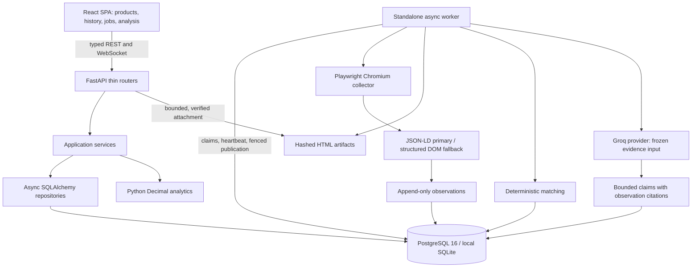

# V2 final engineering report

Verification date: 2026-10-07, Asia/Calcutta. Implementation phases are complete;
the seven-day live-demo check listed below remains open. The subsequent collection
failure investigation verified a real Groq analysis; see
[the follow-up report](V2_COLLECTION_FAILURE_FIX.md) for current test results and
the live collection/analysis identifiers. The Phase 8 verification below is retained
as its original checkpoint record.
This report records local verification. Publishing the repository does not establish
cloud deployment or remote CI success; neither is claimed here.

## Completed phases and checkpoints

| Phase | Delivered capability | Local checkpoint |
| --- | --- | --- |
| 0–3 | Repository setup, backend foundation, core REST API, durable collection worker and Playwright extraction | e3f59d7; existing foundation reconciled rather than rewritten |
| 4 | Deterministic matching and observation-backed decision audits | 8d1332c |
| 5 | React/TypeScript dashboard, product history, jobs and evidence inspector | 292384e |
| 6 | Bounded Groq analysis with exact observation-linked claims | 76225fe |
| 7 | Decimal analytics, trends, confirmed-cohort position and CSV export | 454b7f6 |
| 8 | Request/resource limits, error/provenance hardening, full local Compose stack and documentation | Final Phase 8 checkpoint; inspect git log |

The original V1 application remains in main.py/src with separate container files.
The migration-design document includes an illustrative V1 data-import outline;
no automatic V1 history importer is supplied or claimed by the implementation plan.

## Final architecture

- The FastAPI lifespan owns its engine and async session factory. Request sessions
  commit/rollback through a shared context boundary; tests can supply an engine.
  Production schema changes use Alembic. There is no global production engine.
- Product identity includes ASIN, marketplace and delivery context. Public product
  removal untracks the product without deleting historical observations.
- ProductObservation requires source_url, captured_at, collector, extraction_method
  and evidence_id. Its uniqueness constraint protects repeated publication of the
  same capture on both databases. Application writes append; no update/delete API
  is provided. Direct administrative database access is not blocked by triggers.
- Artifacts retain per-capture identity and source metadata; file hashes and sizes
  are verified before download or analysis. Paths must stay within evidence storage.
  HTML is an attachment, not rendered as executable content in the SPA.
- Durable jobs have leases, heartbeats, retry limits, progress and fenced writes.
  PostgreSQL uses SKIP LOCKED; SQLite claims are atomic. Browser and provider calls
  do not hold a database transaction. Stale workers cannot publish after lease loss.
- A long-lived Chromium browser reuses isolated marketplace contexts; pages close
  after use. Exception/cancellation tests cover teardown. Domain routing constrains
  browser navigation; only supported Amazon product identities are accepted.
- Captchas/access blocks yield explicit errors and cooldowns; partial collection
  preserves captured evidence. No challenge-solving or stealth guarantee is made.

## API capabilities and contracts

All endpoints use Pydantic schemas and service/repository boundaries. API docs are
at /docs and generated contracts are checked in for the frontend.

| Capability | Routes and behavior |
| --- | --- |
| Products | POST/GET /api/products, GET /api/products/{id}, DELETE to untrack; deduplicated identity, marketplace postcode validation |
| Collection | POST /api/products/{id}/collect and /competitors/scan; 202 durable job, optional competitor discovery on collection |
| Observations | GET /api/products/{id}/observations; UTC date filters, offset/limit, preserved immutable captures |
| Competitors | GET /api/products/{id}/competitors; statuses, score/filter/pagination, audit reasons and source observation identities |
| Jobs | GET /api/jobs and /api/jobs/{uuid}; progress at /ws/jobs/{uuid}; polling fallback in React |
| Evidence | GET /api/evidence/{uuid} and /content; metadata and hash/size-verified attachment |
| Analysis | POST /api/products/{id}/analyze; GET /api/analyses/{uuid} and /claims; frozen inputs, deduplication and explicit provenance |
| Analytics | GET /api/products/{id}/analytics and /position; deterministic capture statistics and confirmed-cohort comparisons |
| Export | GET /api/products/{id}/observations/export; bounded CSV with Decimal values, UTC provenance and spreadsheet formula protection |
| Health | /health and /api/health; database/browser-environment information |

Product/job lists use page/limit. Observation/competitor array contracts retain
offset/limit; competitor totals use X-Total-Count. Monetary JSON values are Decimal
strings. Dates are UTC. Useful failures include 404 missing resource, 409 incompatible
state, 413 bounded input/evidence, 422 invalid request, 429 rate/cooldown with Retry-After,
and safe 500/503 application/storage failures. The API does not expose raw provider
errors or execute arbitrary URLs supplied through analysis output.

## Deterministic versus LLM responsibilities

**Deterministic:** input normalization, extraction, evidence hashing, identity,
matching scores/exclusions, job ownership, analytics, authoritative monetary claims,
CSV values and provenance verification. Matching weights title 0.35, brand 0.25,
category 0.20, log price similarity 0.15 and rating 0.05. Hard incompatibilities
override scores. At least 0.7 confirms, at least 0.3 remains ambiguous; lower scores
reject. Missing specifications are not guessed. Match audits retain observation
identities and policy/input metadata. Ambiguous matches are not promoted by an LLM.

**LLM-assisted:** qualitative summary, positioning, competitive explanations and
recommendations over current confirmed saved evidence. ChatGroq sits behind the
provider abstraction; strict structured output, failed-generation recovery and JSON
fallback preserve V1's tested prompt/validation behavior. Inputs are frozen and hashed
with model/prompt/schema identity. Claims cite actual observation UUIDs. Invalid ASINs
are rejected; model quantitative/URL prose is withheld and Python computes price facts.

Schema validation and citations do not prove semantic truth. The numeric-text filter
is deliberately conservative but is not a formal verification of all prose. No
measured AI-accuracy guarantee, product-authenticity claim or autonomous agent is made.

Analytics separate currencies and delivery contexts; missing prices are not zeros.
Seven-day trends compare real captured periods, with explicit insufficient-data
states and zero-denominator handling. Competitive rank/percentile/median describe
the saved confirmed cohort, not the whole market or a simultaneous price survey.

## Final verification

| Check | Result |
| --- | --- |
| Full pytest (V1 + V2) | 311 passed, no skips or warnings; dedicated PostgreSQL 16 and real Chromium enabled |
| Backend coverage | 92.42% (2,495 statements; 189 missed); exceeds 80% gate; only collector/amazon.py excluded as approved |
| Ruff / formatter | Passed |
| mypy | Passed; 79 source files (src, main.py, backend/app, backend/alembic) |
| Compile/import | Passed; backend/app, backend/alembic, scripts and tested migration imports |
| Alembic | Single head 004_analysis_evidence; Compose PostgreSQL current verified at this head |
| SQLite/PostgreSQL migrations | Fresh upgrade, downgrade, schema alignment, uniqueness/FK/provenance and data preservation tests passed |
| Browser/worker | Real browser lifecycle, exception/cancellation, cross-marketplace isolation, queue/lease/heartbeat/blocked/partial/idempotency regressions passed |
| Frontend | 16 tests; TypeScript, ESLint, Prettier and production build passed |
| Dependency audits | pip-audit no known vulnerabilities; full npm audit zero vulnerabilities |
| Docker | Images built; migrations exit 0; PostgreSQL/API healthy; API production mode, worker/SPA/proxy/WebSocket verified |
| Repository hygiene | diff --check passed; tracked secret paths/key patterns reviewed; runtime data ignored |

CI supplies PostgreSQL and Chromium, applies the coverage gate, checks both languages
and builds Compose images. At the Phase 8 verification checkpoint, no push or remote
CI run had occurred; the table above records local results.
The exact phase file changes and test descriptions are in the individual reports.

## Real collection and browser validation

Live Amazon requests were bounded; no CAPTCHA bypass or fabricated browser result
was used. Actual Amazon India ASIN **B0D7M4G3NP** returned a Samsung Galaxy Buds3 Pro
listing with **15544.0000 INR**, default delivery context.

- The isolated native SQLite verification database contains **six genuine baseline
  captures** from separate jobs between approximately 18:57 and 19:39 UTC on
  2026-10-06 (2026-10-07 locally). Repeated prices remain distinct chart points.
- The final native discovery collected two candidate listings. Their conservative
  decisions were ambiguous (score 0.6) and rejected (score 0.0). No fake confirmed
  relationship was inserted to unlock analysis.
- A separate fresh Compose/PostgreSQL flow succeeded through frontend proxy,
  POST product, POST collect, queued WebSocket message, worker and observation/evidence
  persistence. Job: `e2f8d21d-d117-4b74-b32c-7c9a472de0ca`; observation:
  `1057d657-ff06-451b-9f5e-62d218acd717`; artifact:
  `b8c5b1a4-b71a-4ddf-9b5e-c1c581de3e05`.
- That Docker artifact's verified SHA-256 is
  `d8aff462e6a961bc96fe1fd823b9cb9d01adaaf74a9366ecb65f75fbeedcbc11`.
- Actual Chromium rendered all four native routes at 1440px and 390px without page
  errors or document overflow. The price chart shows six real captures. An unknown
  analysis correctly displays the API's not-found error. The evidence inspector and
  attachment hash passed. The built Docker frontend also renders its genuine capture.

These are local run identifiers, not seeded fixtures shipped with the application.
Database files, HTML and engineering-verification screenshots remain ignored.
The intentionally public presentation screenshots in `docs/assets/screenshots/`
are tracked separately; they do not include the live database or captured HTML.

## Readiness findings and known limitations

Phase 8's review fixed the justified High findings: environment selection,
request-error leakage, unbounded evidence, capture metadata inconsistency, missing
request budgets, vulnerable frontend dependencies and container worker stop-signal
wiring. Compose sends SIGINT through the init process so asyncio's cancellation
uses the existing browser/engine teardown; the actual worker stopped with exit 0.
Earlier phases already
addressed engine/browser ownership, leases, duplicate captures, cancellation,
structured extraction and append-only publication; their regressions remain green.
No completed sound architecture was rejected or replaced merely for stylistic reasons.

Remaining accepted/non-blocking engineering limits:

- Local-only, no authentication. The in-memory rate budget is per API process and
  client address; the nginx proxy may share an address. Distributed quotas and
  secure public hosting are not implemented or claimed.
- Single standalone worker/browser profile ownership is the supported run model.
  Multi-worker browser-state coordination and load/scale testing are not supplied.
- File/input caps bound individual operations. Total storage retention/garbage
  collection and scheduled collection are not implemented; preserve database and
  evidence together in manual backups.
- Amazon availability, selectors, asynchronous content and location confirmation
  vary. V2 reports blocked/partial jobs; no headed recovery UI or guaranteed success.
- Evidence proves capture provenance, not authenticity, product quality or all AI
  semantics. Matching remains conservative lexical/structured scoring.
- History reflects samples, not complete time coverage. Unknown currencies, omitted
  prices and unverified delivery states yield exclusions, not fabricated figures.
- Recharts 2 and ESLint 9 have future maintenance/deprecation considerations; audits
  currently report no known vulnerabilities. Upgrading unrelated frameworks is deferred.

**Live-demo gates:** the subsequent follow-up completed a real Groq analysis over
the corrected Amazon India baseline and 20 confirmed saved candidates, including
browser inspection of its source evidence. The real-provider gate is now verified.
Same-day native/Docker captures do **not** establish seven days of history. The
seven-day criterion remains pending genuine observations across elapsed days.

## Truthful interview/resume claims

The repository supports saying that I built a typed React/FastAPI application with
an async SQLAlchemy PostgreSQL/SQLite persistence layer, a durable leased Playwright
worker, immutable capture provenance, auditable deterministic matching, Decimal
price analytics and bounded Groq interpretation with observation citations. I can
demonstrate real local Amazon collection and evidence inspection, and describe the
tested failure, cancellation, idempotency and migration boundaries.

It does not support claiming production customers, measured large-scale throughput,
guaranteed Amazon access, CAPTCHA circumvention, measured AI accuracy, seven-day
history already collected or public
deployment. Follow V2_DEMO_GUIDE.md to run the finished local implementation.
